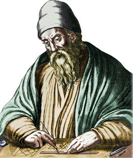
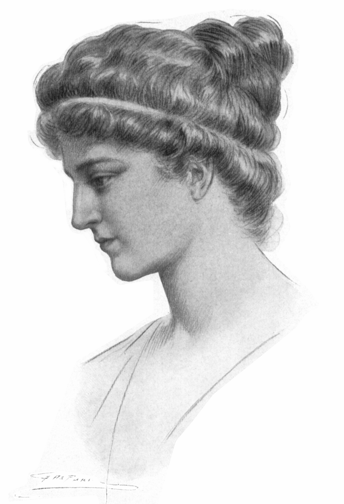
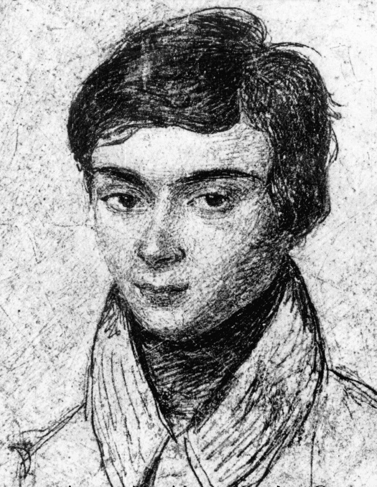
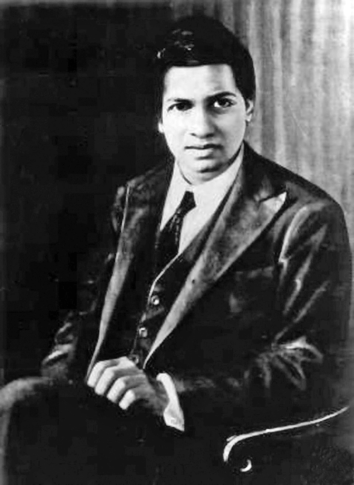

<!-- Breadcrumbs -->
· [← Seção de Matemática](../matematica/index.qmd)

---

# 📚 Biografias Matemáticas

Nesta seção reunimos histórias de **grandes matemáticos e cientistas** que marcaram a humanidade.  
Alguns foram também poetas, filósofos ou artistas — mostrando que a matemática dialoga com múltiplas formas de expressão.

::: {.callout-tip title="Como navegar"}
- Use o sumário à direita (**TOC**) para saltar entre os perfis.  
- Cada biografia pode ter **múltiplas partes** (séries), com textos, imagens e trechos em persa/latim/greco quando apropriado.  
:::

---

## ✨ Destaque — Omar Khayyam (1048–1131)

{.bio-img alt="Retrato artístico de Omar Khayyam"}

Matemático, astrônomo, filósofo e **poeta** persa.  
Autor do **Rubaiyat** (quadras célebres), pioneiro no estudo das **equações cúbicas** e participante da reforma do **calendário Jalali**.

**Série completa:**

- [📚 Omar Khayyam (Parte 1): Matemático e Poeta](omar-khayyam/omar-khayyam-parte1.qmd)  
- [📚 Omar Khayyam (Parte 2): Rubaiyat](omar-khayyam/omar-khayyam-parte2.qmd)  
- [📚 Omar Khayyam (Parte 3): Rubaiyat](omar-khayyam/omar-khayyam-parte3.qmd)  
- [📚 Omar Khayyam (Parte 4): Rubaiyat](omar-khayyam/omar-khayyam-parte4.qmd)

---

## 🗂️ Em preparação

Abaixo, futuras entradas desta seção. Quando o post sair, o card será atualizado com o link.

::: {.columns}
::: {.column width="50%"}

### Euclides
{.bio-img alt="Imagem ilustrativa de Euclides"}

*O pai da geometria.*  
Organizou os **Elementos**, base da matemática por séculos.

:::
::: {.column width="50%"}

### Hipátia de Alexandria
{.bio-img alt="Imagem ilustrativa de Hipátia"}

*Matemática e filósofa neoplatônica.*  
Comentou obras de **Diofanto** e **Apolônio**.

:::
:::

::: {.columns}
::: {.column width="50%"}

### Évariste Galois
{.bio-img alt="Imagem ilustrativa de Évariste Galois"}

*Gênio da álgebra e do destino trágico.*  
Fundador da **Teoria de Grupos** para resolubilidade de equações.

:::
::: {.column width="50%"}

### Srinivasa Ramanujan
{.bio-img alt="Imagem ilustrativa de Srinivasa Ramanujan"}

*O místico dos números.*  
Séries, partições e identidades notáveis com **Hardy**.

:::
:::

---

## 💡 Como esta seção se organiza

- **Perfil resumido** → quem foi, época, principais contribuições.  
- **Séries** → posts temáticos (ex.: poesia + matemática, filosofia, legado científico).  
- **Recursos** → imagens, trechos no idioma original (com renderização adequada para HTML e PDF), bibliografia.

---

## 🔙 Navegação

<!-- Breadcrumbs -->
· [← Seção de Matemática](../matematica/index.qmd) · 🔝 [Topo](#top)

---

*Blog do Marcellini — História, Ciência e Beleza em Matemática.*

:::{.callout-note}
*Criado por Blog do Marcellini com ❤️ e código.*
:::

## 🔗 Links Úteis

- 🧑‍🏫 [Sobre o Blog](../pessoal/sobre-o-blog.qmd)
- 💻 <a href="https://github.com/marcellini-celso/blog-marcellini-pt.git" target="_blank">GitHub do Projeto</a>
- 📬 [Contato por E-mail](mailto:prof.marcellini@gmail.com)

