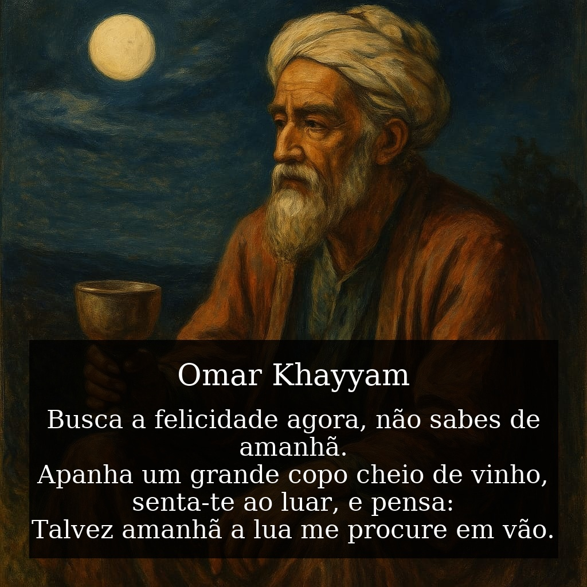

· [← Biografias Matemáticas](../index.qmd) · [← Seção de Matemática](../../matematica/index.qmd)

---

{alt="Retrato artístico de Omar Khayyam"}

# ✨ Introdução

Poucos personagens da história uniram de forma tão marcante a **matemática** e a **poesia** quanto **Omar Khayyam** (1048–1131).  
Matemático, astrônomo, filósofo e poeta persa, Khayyam é lembrado no Ocidente principalmente pelo seu livro de poemas em quatro versos, o **Rubaiyat**.  
Mas sua obra científica foi igualmente notável.

# 🧮 Matemático e Cientista

Omar Khayyam foi um dos grandes matemáticos de sua época:

- Classificou e estudou sistematicamente as **equações cúbicas**, resolvendo-as geometricamente pela interseção de cônicas.  
- Comentou os **Elementos de Euclides**, questionando o postulado das paralelas, antecipando ideias que só seriam plenamente exploradas séculos mais tarde com as geometrias não-euclidianas.  
- Participou da **reforma do calendário persa** (1079), criando o **calendário Jalali**, mais preciso que o gregoriano em termos astronômicos.

::: {.callout-note title="📖 Citação matemática"}
*"Omar Khayyam considerava que as equações cúbicas não poderiam ser resolvidas por régua e compasso, mas por interseções de cônicas — antecipando soluções algébricas modernas."*
:::

# 📝 O Poeta do Tempo

Apesar de seu legado matemático, Khayyam se tornou célebre por seus **rubaiyat** (plural de rubai, quadra poética persa).  
Neles, refletiu sobre o tempo, a vida breve, o vinho e a busca da felicidade.

Aqui está o famoso quatrain:

::: {.content-visible when-format="html"}

<link href="https://fonts.googleapis.com/css2?family=Vazirmatn:wght@400;600&display=swap" rel="stylesheet">

## 📜 Original em persa

<div dir="rtl" lang="fa" style="font-family:'Vazirmatn','Amiri','Noto Naskh Arabic',serif; font-size:1.25rem; line-height:1.9;">
باده بنوش و بگذران ای دل چه دانی زین گذر<br/>
که فردا در طلب ما ماه جوید بی‌ثمر
</div>

:::

---

```markdown
## 🔤 Transliteração

Bādeh benoosh o bogzarān, ey del, che dānī zīn gozar,  
Ke fardā dar talab-e mā māh juyad bī-samar.
```

## 🌙 Tradução em português

> Busca a felicidade agora, não sabes de amanhã.  
> Apanha um grande copo cheio de vinho,  
> senta-te ao luar, e pensa:  
> Talvez amanhã a lua me procure em vão.

# 🌍 Legado

Khayyam nos deixou uma herança dupla:  
um **espírito científico**, que investigava o universo com rigor matemático, e uma **voz poética**, que lembrava da fragilidade da vida humana.

Seu legado ressoa ainda hoje tanto em salas de aula de matemática quanto em antologias literárias.

# 🔎 Referências

- Boyer, Carl. *História da Matemática*.  
- Edward FitzGerald (trad.). *Rubaiyat of Omar Khayyam*.  
- E. H. Whinfield. *The Quatrains of Omar Khayyam*.  

---

## 🔙 Navegação

<!-- Breadcrumbs -->
🎯 **Próximo Post:** 👉 [📚 Omar Khayyam (Parte 2): Rubaiyat](omar-khayyam-parte2.qmd)

· [← Biografias Matemáticas](../index.qmd) · [← Seção de Matemática](../../matematica/index.qmd) · 🔝 [Topo](#top)

---

*Blog do Marcellini — História, Ciência e Beleza em Matemática.*

:::{.callout-note}
*Criado por Blog do Marcellini com ❤️ e código.*
:::

## 🔗 Links Úteis

- 🧑‍🏫 [Sobre o Blog](../../pessoal/sobre-o-blog.qmd)
- 💻 <a href="https://github.com/marcellini-celso/blog-marcellini-pt.git" target="_blank">GitHub do Projeto</a>
- 📬 [Contato por E-mail](mailto:prof.marcellini@gmail.com)

