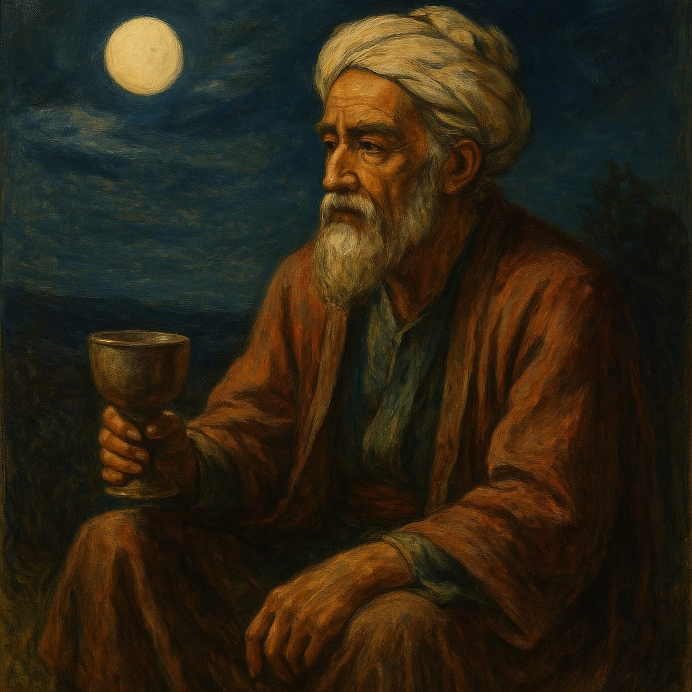

· [← Biografias Matemáticas](../index.qmd) · [← Seção de Matemática](../../matematica/index.qmd)

---

<!-- Breadcrumbs -->
🎯 **Post Anterior:** 👉 [📚 Omar Khayyam (Parte 2): Rubaiyat](omar-khayyam-parte2.qmd)

---

{fig-align="center" width="60%" alt="Retrato artístico de Omar Khayyam"}

::: {.callout-note title="📜 Rubaiyat (tradução em português)"}
Senta-te à beira do rio e contempla o fluir da vida:  
esse sinal do mundo que passa já nos basta.
:::

# ✨ Introdução

Nesta terceira parte da série sobre **Omar Khayyam**, apresentamos rubaiyat mais filosóficos.  
Aqui Khayyam reflete sobre:

- A passagem inexorável do **tempo**  
- O **destino** inevitável  
- A certeza da **morte**  

Essas quadras revelam um espírito lúcido e inquieto, que vê na brevidade da vida um convite à contemplação.

# ⏳ Rubaiyat 1 — O Tempo Fugitivo

::: {.content-visible when-format="html"}

<link href="https://fonts.googleapis.com/css2?family=Vazirmatn:wght@400;600&display=swap" rel="stylesheet">

## 📜 Original em persa

<div dir="rtl" lang="fa" style="font-family:'Vazirmatn','Amiri','Noto Naskh Arabic',serif; font-size:1.25rem; line-height:1.9;">
بر لب جوی نشین و گذر عمر ببین
کاین اشارت ز جهان گذران ما را بس
</div>

:::


### 📦 Transliteração

```markdown
Bar lab-e juy neshīn o gozar-e ‘omr bebin,  
K’īn eshārat ze jahān-e gozarān mā rā bas.
```

## 🌙 Tradução em português

> Senta-te à beira do rio e contempla o fluir da vida:  
> esse sinal do mundo que passa já nos basta.

# 🧭 Rubaiyat 2 — O Destino Escrito

::: {.content-visible when-format="html"}

<link href="https://fonts.googleapis.com/css2?family=Vazirmatn:wght@400;600&display=swap" rel="stylesheet">

## 📜 Original em persa

<div dir="rtl" lang="fa" style="font-family:'Vazirmatn','Amiri','Noto Naskh Arabic',serif; font-size:1.25rem; line-height:1.9;">
در کارگه کوزه‌گری دیدم دو هزار
کوزه سخن می‌گفتند با هم پنهان

</div>

:::

### 📦 Transliteração

```markdown
Dar kār-gah-e kouze-garī dīdam do hezār,  
Kouze sokhan mīgofteand bā ham penhān.
```

## 🌙 Tradução em português

> Na oficina do oleiro vi milhares de jarros,  
> e eles falavam entre si em segredo.

*(metáfora de que o destino dos homens é moldado como barro pelas mãos do oleiro cósmico)*

# 💀 Rubaiyat 3 — A Morte Inevitável

::: {.content-visible when-format="html"}

<link href="https://fonts.googleapis.com/css2?family=Vazirmatn:wght@400;600&display=swap" rel="stylesheet">

## 📜 Original em persa

<div dir="rtl" lang="fa" style="font-family:'Vazirmatn','Amiri','Noto Naskh Arabic',serif; font-size:1.25rem; line-height:1.9;">
چون نیست بقا، چه غم از مرگ مرا
یک جام شراب باده نوشیم و روا
</div>

:::


### 📦 Transliteração

```markdown
Chon nīst baqā, che gham az marg-e marā?  
Yek jām-e sharāb benushīm o ravā.
```

## 🌙 Tradução em português

> Já que não há permanência, por que temer a minha morte?  
> Bebamos uma taça de vinho — e que seja justo assim.

# 🌍 Conclusão

Nos rubaiyat filosóficos, Omar Khayyam encara a morte sem ilusões,  
o destino como inevitável e o tempo como corrente que não cessa.  
Sua poesia ecoa uma matemática da existência:  
cada vida é uma equação finita,  
e a solução está em aproveitar o instante presente.

---

## 🔙 Navegação

<!-- Breadcrumbs -->
🎯 **Próximo Post:** 👉 [📚 Omar Khayyam (Parte 4): Rubaiyat](omar-khayyam-parte4.qmd)

· [← Biografias Matemáticas](../index.qmd) · [← Seção de Matemática](../../matematica/index.qmd) · 🔝 [Topo](#top)

---

*Blog do Marcellini — História, Ciência e Beleza em Matemática.*

:::{.callout-note}
*Criado por Blog do Marcellini com ❤️ e código.*
:::

## 🔗 Links Úteis

- 🧑‍🏫 [Sobre o Blog](../../pessoal/sobre-o-blog.qmd)
- 💻 <a href="https://github.com/marcellini-celso/blog-marcellini-pt.git" target="_blank">GitHub do Projeto</a>
- 📬 [Contato por E-mail](mailto:prof.marcellini@gmail.com)

