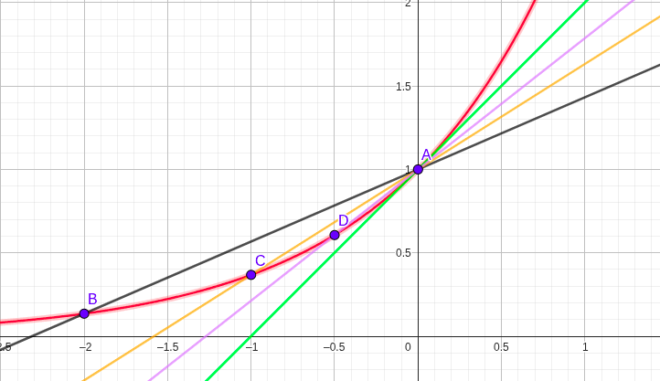
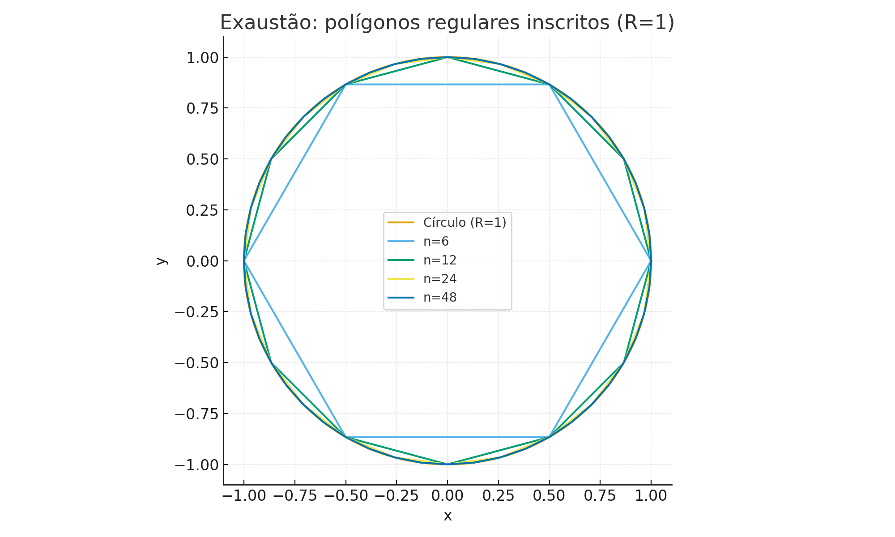

[← Sumário do Curso](../index.qmd) · [← Cursos de Matemática](../../index.qmd) · [← Seção de Matemática](../../../../matematica/index.qmd)

# 🧠 Módulo 1.1: O que é Cálculo? História e aplicações

::: {.callout-tip title="📚 Pré-requisitos (leves)"}
- Noções básicas de **álgebra** (operações com expressões, equações simples).  
- Familiaridade com **funções elementares** (reta, parábola, exponencial, logaritmo).  
- Capacidade de interpretar **gráficos cartesianos**.  

> As fórmulas deste curso são preparadas em **LaTeX**, o padrão acadêmico para escrita matemática,  
> o que garante **clareza** e **qualidade tipográfica** na apresentação.  
> 👉 Você verá apenas o resultado final, sem precisar conhecer LaTeX.
:::

---

## ✨ O que é o Cálculo?

### 🌱 Intuição inicial

Imagine um carro na estrada: o velocímetro mostra **como a velocidade muda agora**; já a distância total depende de **somar pequenos trechos**.  
Esse é o espírito do cálculo: **estudar a mudança e o acúmulo** no mundo real.

### 📐 Formulação matemática (enxuta)

- **Mudança** → taxas de variação (derivadas).  
- **Acúmulo** → totais e áreas (integrais).  
- **Limite** → base formal que dá precisão ao “instantâneo” e ao “contínuo”.

---

## Os dois problemas fundamentais do cálculo

### 🌱 Intuição: tangentes e áreas

1. **Problema da tangente:** qual é a inclinação de uma curva em um ponto?  
2. **Problema da área:** qual é a área de uma região limitada por curvas?

### 📐 Formulação matemática

- **Tangente** em \(A=(a,f(a))\): a inclinação da tangente é o valor para o qual as **secantes** convergem quando o segundo ponto se aproxima de \(A\).  
- **Área** em \([a,b]\): a área sob \(y=f(x)\) é o valor para o qual as **somas de pequenos retângulos** convergem quando refinamos a partição.

---

## 🔎 Motivação visual — o problema da tangente

Usaremos a função \(y=e^x\) no ponto \(A(0,1)\). Na figura, retas **secantes** $(A–B, A–C, A–D)$ vão “girando” até a **reta verde**, que representa a **tangente** em \(A\).

**Figura — Aproximação da tangente por secantes para \(y=e^x\)**

{fig-align="center" width="70%"}

### 🧮 Mini exemplo numérico (sem notação de limite)

Para \(y=e^x\) em \(x=0\), considere a secante entre \(x=0\) e \(x=h\).  
A inclinação dessa secante é
\[
m(h)=\frac{e^{h}-e^{0}}{h}=\frac{e^{h}-1}{h}.
\]

Tabela (valores ilustrativos):

| \(h\)   | Expressão de \(m(h)\)                  | Valor aproximado |
|:------:|:---------------------------------------|:----------------:|
| 1      | \(\dfrac{e-1}{1}\)                     | 1.7183           |
| 0.5    | \(\dfrac{e^{0.5}-1}{0.5}\)             | 1.2974           |
| 0.1    | \(\dfrac{e^{0.1}-1}{0.1}\)             | 1.0517           |
| 0.01   | \(\dfrac{e^{0.01}-1}{0.01}\)           | 1.0050           |

📌 Observação: os valores numéricos mostram que, **à medida que \(h \to 0\), \(m(h)\) se aproxima de 1**.  
Logo, a inclinação da **reta tangente** ao gráfico de \(y=e^x\) em \(x=0\) é 1.

Esse é o **problema da tangente**, um dos dois problemas fundamentais do cálculo.

---

## 🔎 Motivação visual — o problema da área (método de exaustão)

Considere um **círculo de raio 1**. Inscrevemos **polígonos regulares** de \(n\) lados.  
Quando \(n\) cresce, a área do polígono se aproxima da **área do círculo** — este é o método de **exaustão** de Arquimedes.

**Figura — Polígonos inscritos aproximando a área do círculo (R=1)**

{fig-align="center" width="90%"}

### 🧮 Exemplo numérico (área de polígono inscrito)

Para um polígono de \(n\) lados inscrito no círculo unitário, a área é
\[
A_n=\frac{n}{2}\,\sin\!\left(\frac{2\pi}{n}\right).
\]

| \(n\) | \(A_n\)  | \(\pi - A_n\) |
|:----:|:--------:|:-------------:|
| 4    | 2.0000   | 1.1416        |
| 6    | 2.5981   | 0.5435        |
| 12   | 3.0000   | 0.1416        |
| 24   | 3.1058   | 0.0358        |
| 48   | 3.1326   | 0.0090        |
| 96   | 3.1394   | 0.0022        |

📌 **Lembrete:** a área do círculo é dada por \(\pi r^2\).  
No caso \(r=1\), a área é \(\pi \approx 3.1416\).  
Portanto, a última coluna da tabela mostra como a diferença \(\pi - A_n\) tende a zero à medida que \(n\) cresce.  

[Baixar tabela (CSV)](../data/area_exaustao_table.csv)

Esse raciocínio antecipa a **integral** como ferramenta para medir áreas e acúmulos — o **problema da área**, o outro problema fundamental do cálculo.

---

## 📜 Breve história do Cálculo

- **Arquimedes (séc. III a.C.)**: método da **exaustão** (áreas e volumes) — semente do cálculo integral.  
- **Fermat (séc. XVII)**: técnicas para **tangentes** — semente do cálculo diferencial.  
- **Newton (1643–1727)**: focado em movimento e Física; chamou derivadas de *fluxões*.  
- **Leibniz (1646–1716)**: notação clara e geral (símbolos que usamos até hoje).

::: {.callout-tip title="Teorema Fundamental do Cálculo (ideia)"}
Mais adiante veremos que **mudança** (derivadas) e **acúmulo** (integrais) estão conectados por um resultado central — o **Teorema Fundamental do Cálculo** — que dá unidade à disciplina.
:::

---

## ✅ Encerrando a introdução

- O cálculo responde a duas perguntas universais:  
  1) **Quão rápido algo muda agora?** (tangentes/derivadas)  
  2) **Quanto se acumulou no intervalo?** (áreas/integral)
- Nesta abertura, evitamos símbolos formais de limite/derivada/integral — focamos na **intuição visual e histórica**.  
- A formalização virá passo a passo, sempre conectada a **figuras** e **exemplos numéricos**.

---

🎯 **Próximo Post:** 👉 [1.2 Conjuntos Numéricos](1.2-conjuntos.qmd)

[← Sumário do Curso](../index.qmd) · [← Cursos de Matemática](../../index.qmd) ·  🔝 [Topo](1.1-introducao.qmd)

---

*Blog do Marcellini — Explorando a Matemática com Rigor e Beleza.*

:::{.callout-note}
Criado por Blog do Marcellini com ❤️ e código.
:::

