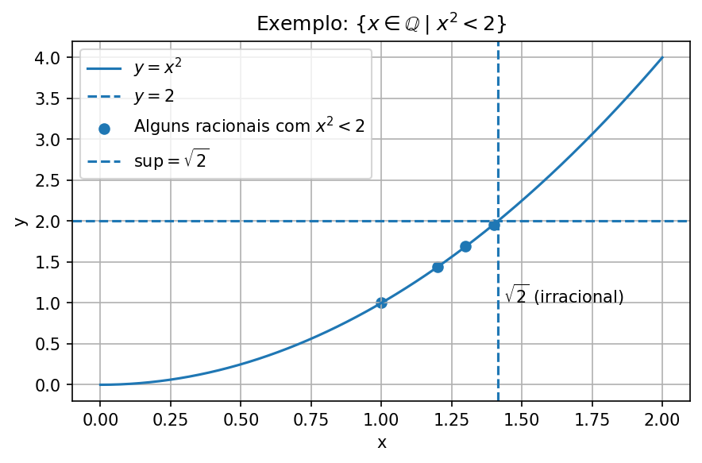

---

[← Voltar para o Sumário do Curso de Cálculo Diferencial e Integral 🎓 🧮](/posts/cursos/matematica/calculo/index.qmd)

[← Voltar para os Cursos de Matemática 🎓 🧮](/posts/cursos/matematica/index.qmd)

[← Voltar para a Seção de Matemática 🧮](/posts/matematica/index.qmd)

---

🎯 **Post Anterior:** 👉 [1.2 Conjuntos Numéricos](/posts/cursos/matematica/calculo/modulo-1/1.2-conjuntos.qmd)

---

# 🔢 Módulo 1.2 AP: Conjuntos Numéricos -- Aprofundamento

::: {.callout-note title="📌 Objetivos do Post"}
- Demonstrar que $\sqrt{2}$ não é um número racional utilizando o método de redução ao absurdo;
- Discutir o conceito de conjuntos enumeráveis e não enumeráveis;
- Apresentar o Método Diagonal de Cantor e suas aplicações aos conjuntos dos números racionais e reais. Utilizamos o Método Diagonal de Cantor para demonstrar a não enumerabilidade do conjunto dos números reais, em contraste com a enumerabilidade dos racionais;
- Estudar a finitude na representação decimal de números racionais;
- Explorar propriedades estruturais dos números reais, com ênfase na completude e na estrutura de corpo ordenado completo;
- Visualizar subconjuntos de $\mathbb{Q}$ com auxílio de código em Python;
- Consolidar os conhecimentos por meio de exercícios de revisão.
:::


## 🧠 Aprofundamento: Demonstração de que $\sqrt{2}$ não é racional

::: {.callout-note collapse=false title="🧠 Aprofundamento: Demonstração de que $\sqrt{2}$ não é racional"}
**Proposição:** $\sqrt{2} \notin \mathbb{Q}$, ou seja, $\sqrt{2}$ é irracional.

**Demonstração (por redução ao absurdo):**

Suponha, por absurdo, que $\sqrt{2}$ seja um número racional. Então, existem inteiros $a$ e $b$, com $b \ne 0$, tais que:

$$
\sqrt{2} = \frac{a}{b}
$$

Além disso, podemos supor que a fração $\dfrac{a}{b}$ está **irredutível**, ou seja, $\mathrm{mdc}(a, b) = 1$.

Elevando ambos os lados ao quadrado:

$$
2 = \frac{a^2}{b^2} \Rightarrow a^2 = 2b^2
$$

Portanto, $a^2$ é **par**, o que implica que $a$ também é par, pois se $a$ fosse ímpar, $a^2$ também seria ímpar. Assim, existe um inteiro $k$ tal que $a = 2k$.

Substituindo:

$$
(2k)^2 = 2b^2 \Rightarrow 4k^2 = 2b^2 \Rightarrow b^2 = 2k^2
$$

Logo, $b^2$ também é par, e portanto $b$ é par.

**Contradição**: $a$ e $b$ são pares ⇒ $\mathrm{mdc}(a, b) \geq 2$,  
contrariando a hipótese de que a fração $\dfrac{a}{b}$ era irredutível.

Logo, a suposição de que $\sqrt{2}$ é racional é falsa.  
$$
\therefore \sqrt{2} \notin \mathbb{Q}
$$
:::


## 🧠 Aprofundamento: Comentário sobre o método de demonstração por *redução ao absurdo*

::: {.callout-important collapse=false title="🧠 Aprofundamento: Comentário sobre o método de demonstração por *redução ao absurdo*"}
A demonstração da irracionalidade de $\sqrt{2}$ é um clássico exemplo de **prova por redução ao absurdo** (ou **prova indireta**).

Nesse método, parte-se da **suposição contrária** ao que se deseja provar — no caso, supõe-se que $\sqrt{2} \in \mathbb{Q}$, ou seja, que pode ser escrita como uma fração $\dfrac{a}{b}$ com $a$ e $b \in \mathbb{Z}$ e $\mathrm{mdc}(a,b) = 1$.

A partir dessa hipótese, deduz-se logicamente que $a$ e $b$ seriam ambos pares — o que contradiz a condição inicial de que $a$ e $b$ não têm fatores comuns.

Essa contradição mostra que a suposição original não pode ser verdadeira.  
Assim, conclui-se que $\sqrt{2}$ **não** é um número racional.

Esse método é bastante utilizado em várias áreas da Matemática, principalmente quando não se conhece uma forma direta de prova.
:::


## 🧠 Aprofundamento: Conjuntos Enumeráveis e Não Enumeráveis

::: {.callout-note collapse=false title="🧠 Aprofundamento: Conjuntos Enumeráveis e Não Enumeráveis"}
- **Conjunto Enumerável** (ou **contável**): é um conjunto cujos elementos podem ser colocados em correspondência biunívoca com os números naturais. Ou seja, podemos listar seus elementos numa sequência (mesmo que infinita).  
  Exemplos:
  - Conjunto dos números naturais $\mathbb{N}$.
  - Conjunto dos inteiros $\mathbb{Z}$.
  - Conjunto dos racionais $\mathbb{Q}$.

- **Conjunto Não Enumerável** (ou **incontável**): é um conjunto tão “grande” que **não pode ser listado** em sequência, mesmo infinita.  
  O **exemplo** mais famoso é:
  - O conjunto dos números reais $\mathbb{R}$ $(\text{e, portanto, dos irracionais } \mathbb{R} \setminus \mathbb{Q})$.

**Resumo:**  
Enumerável → Pode listar (como uma fila infinita).  
Não enumerável → Não pode listar; tem “mais” elementos que os naturais.
:::


## 🧠 Aprofundamento: O Método Diagonal de Cantor e a Não Enumerabilidade dos Reais

::: {.callout-important collapse=false title="🧠 Aprofundamento: O Método Diagonal de Cantor e a Não Enumerabilidade dos Reais"}
O **método diagonal de Cantor** é uma prova elegante e poderosa criada por **Georg Cantor** para demonstrar que **os números reais são mais numerosos do que os números naturais**, ou seja, que o conjunto dos reais não é enumerável.

🧩 **Ideia principal**

Cantor mostrou que **nenhuma lista que tente enumerar todos os números reais entre 0 e 1 pode ser completa**. Ele faz isso construindo um número novo, que **difere de todos os números da lista**, alterando **diagonalmente** os dígitos da representação decimal.

🔍 **Passo a passo simplificado:**

1. Suponha que seja possível listar todos os números reais entre 0 e 1 como:

   \begin{equation}
      \begin{aligned}
         & x_1=0 . a_{11} a_{12} a_{13} a_{14} \\
         & x_2=0 . a_{21} a_{22} a_{23} a_{24} \\
         & x_3=0 . a_{31} a_{32} a_{33} a_{34} \\
         & \cdots
      \end{aligned}
   \end{equation}   

2. Cantor constrói um novo número real, alterando **os dígitos da diagonal**:  
   - Escolhe o 1º dígito do 1º número, o 2º dígito do 2º número, o 3º dígito do 3º número, etc.  
   - Em cada posição, troca o dígito por um diferente (por exemplo, se for 5, troca por 6).

3. O novo número, assim construído, **difere de cada número da lista em ao menos um dígito** — o da diagonal.

✅ **Conclusão:**

Esse número **não pode estar na lista original**, o que leva à contradição: portanto, **os reais não são enumeráveis**.

<div style="text-align: center;">
  
  <figcaption><strong>Método Diagonal de Cantor</strong></figcaption>
  <p style="font-size: 0.8em; margin-top: 0.5em;">
    Crédito: Por Jochen Burghardt — Obra do próprio, <a href="https://commons.wikimedia.org/w/index.php?curid=30402203" target="_blank">CC BY-SA 3.0</a>
  </p>
</div>

:::

## 🧠 Aprofundamento: O Método Diagonal de Cantor e a Enumerabilidade dos Racionais
::: {.callout-note collapse=false title="O Método Diagonal de Cantor e a Enumerabilidade dos Racionais"}

Uma descoberta surpreendente sobre os números racionais foi feita no final do século XIX e impulsionou a criação da **Teoria dos Conjuntos** por **Georg Cantor**, a partir de 1872. Embora os números racionais sejam densos e não possam ser ordenados de forma simples por magnitude, eles podem ser dispostos como uma sequência infinita $r_1, r_2, \ldots, r_n, \ldots$ na qual todo número racional aparece uma vez.

Dessa forma, os números racionais podem ser enumerados ou contados como primeiro, segundo, ..., enésimo número racional, mesmo que essa ordem não corresponda à ordem de grandeza dos números. Esse resultado — que também vale para os racionais contidos em qualquer intervalo — é expressado assim: **os números racionais são enumeráveis**, ou formam um **conjunto enumerável**.

Para provar esse resultado, basta fornecer uma regra para organizar os números racionais positivos em uma sequência. Todo número racional positivo pode ser escrito como $p/q$, onde $p$ e $q$ são naturais. Para cada inteiro positivo $k$, há exatamente $k-1$ frações da forma $p/q$ em que $p + q = k$. Estas são organizadas em ordem crescente de $p$.

Escrevendo essas listas para $k = 2, 3, 4, \ldots$, obtemos (ver Figura abaixo) uma sequência que contém todos os racionais positivos. Omitindo as frações cujos numeradores e denominadores têm um fator comum maior que 1 — pois representam o mesmo número racional que uma fração anterior — obtemos a sequência:

$$
\frac{1}{1}, \frac{1}{2}, \frac{2}{1}, \frac{1}{3}, \frac{3}{1}, \frac{1}{4}, \frac{2}{3}, \frac{3}{2}, \frac{4}{1}, \frac{1}{5}, \frac{5}{1}, \frac{1}{6}, \frac{2}{5}, \ldots
$$

na qual todo número racional positivo aparece exatamente uma vez. Uma sequência similar contendo todos os números racionais (positivos e negativos) ou apenas os contidos em um intervalo particular pode ser facilmente construída.


<div style="text-align: center;">
  
  <figcaption><strong>🧠 Método Diagonal de Cantor: Enumerabilidade dos Racionais Positivos</strong></figcaption>
  <p style="font-size: 0.8em; margin-top: 0.5em;">
    Crédito: Por <a href="//commons.wikimedia.org/wiki/User:Cronholm144" title="User:Cronholm144">Cronholm144</a> - <span class="int-own-work" lang="pt">Obra do próprio</span>, <a href="http://creativecommons.org/licenses/by-sa/3.0/" title="Creative Commons Attribution-Share Alike 3.0">CC BY-SA 3.0</a>, <a href="https://commons.wikimedia.org/w/index.php?curid=2203732">Hiperligação</a>
  </p>
</div>

> A demonstração do teorema segue a apresentação clássica encontrada em Courant e John (1996).

:::


## 🧠 Aprofundamento: Demonstração da Finitude da Representação Decimal

> 🔍 **Teorema:** A fração $\dfrac{a}{b}$ tem representação decimal finita **se e somente se** o denominador $b$ (na forma irredutível) tem como fatores **apenas 2 e 5.**

::: {.callout-important collapse=false title="🧠 Aprofundamento: Demonstração da Finitude da Representação Decimal"}

🔍 **Teorema:** A fração $\dfrac{a}{b}$ tem representação decimal finita **se e somente se** o denominador $b$ (na forma irredutível) tem como fatores **apenas 2 e 5.**

---

✍️ **Demonstração:**

 Seja uma fração racional irredutível $\dfrac{a}{b}$, com $a \in \mathbb{Z}$ e $b \in \mathbb{N}$.

 A representação decimal de $\dfrac{a}{b}$ será **finita** se e somente se for possível escrevê-la como uma fração com denominador da forma $10^n$.

 Sabemos que $10^n = 2^n \cdot 5^n$, ou seja, os únicos fatores primos de $10^n$ são **2** e **5**.

 Logo, se a fração $\dfrac{a}{b}$ puder ser reescrita com denominador $10^n$, então o denominador original $b$ (já simplificado com $a$) **só pode conter os fatores primos 2 e 5**.

 Se $b$ tiver algum outro fator primo (como 3, 7, 11, etc.), então **não será possível transformá-lo em uma potência de 10**, e sua representação decimal será **infinita periódica** (isto é, uma **dízima periódica**).

 ---

 🔢 **Exemplos**:

 - $\dfrac{3}{8} = 0{,}375$ ✅  
   (Denominador $8 = 2^3$, apenas fator 2 → decimal finita)

 - $\dfrac{7}{20} = 0{,}35$ ✅  
   (Denominador $20 = 2^2 \cdot 5$, apenas fatores 2 e 5 → decimal finita)

 - $\dfrac{4}{15} = 0{,}\overline{26}$ ❌  
   (Denominador $15 = 3 \cdot 5$, contém fator 3 → dízima periódica)

 - $\dfrac{5}{6} = 0{,}\overline{83}$ ❌  
   (Denominador $6 = 2 \cdot 3$, contém fator 3 → dízima periódica)

 ✅ **Conclusão:** A fração $\dfrac{a}{b}$ tem representação decimal finita **se e somente se** o denominador $b$ (na forma irredutível) tem como fatores **apenas 2 e 5**.

:::


## 🧠 Aprofundamento: Propriedades dos Números Reais e a Estrutura de Corpo Ordenado Completo

::: {.callout-note collapse=false title="🧠 Aprofundamento: Propriedades dos Números Reais e a Estrutura de Corpo Ordenado Completo"}

Para compreender melhor as propriedades dos números reais, é útil adotar uma perspectiva mais abstrata e estrutural. A seguir, apresentamos um resumo das propriedades que caracterizam $\mathbb{R}$ como um **corpo ordenado completo**.

---

🔷 **1. Corpo $(\mathbb{R}, +, \cdot)$**

Um **corpo** (ou **campo**) é um conjunto não vazio munido de duas operações, adição ($+$) e multiplicação ($\cdot$), satisfazendo as seguintes propriedades:

 **Aditivas:**

- *Fechamento:* Se $a, b \in \mathbb{R}$, então $a + b \in \mathbb{R}$.
- *Associatividade:* $(a + b) + c = a + (b + c)$.
- *Elemento neutro:* Existe $0 \in \mathbb{R}$ tal que $a + 0 = a$.
- *Elemento simétrico:* Para cada $a \in \mathbb{R}$, existe $-a$ tal que $a + (-a) = 0$.
- *Comutatividade:* $a + b = b + a$.

 **Multiplicativas:**

- *Fechamento:* Se $a, b \in \mathbb{R}$, então $a \cdot b \in \mathbb{R}$.
- *Associatividade:* $(a \cdot b) \cdot c = a \cdot (b \cdot c)$.
- *Elemento neutro:* Existe $1 \in \mathbb{R}$, com $1 \ne 0$, tal que $a \cdot 1 = a$.
- *Inverso multiplicativo:* Se $a \ne 0$, existe $a^{-1} \in \mathbb{R}$ tal que $a \cdot a^{-1} = 1$.
- *Comutatividade:* $a \cdot b = b \cdot a$.

 **Distributividade:**

- $a \cdot (b + c) = a \cdot b + a \cdot c$.

---

 🔶 **2. Corpo Ordenado**

Além das propriedades anteriores, o conjunto dos reais possui uma **relação de ordem total** $(\leq)$ compatível com as operações, ou seja:

- **Tricotomia**: Para todo $a \in \mathbb{R}$, vale exatamente uma das alternativas: 
$$a > 0 \text{, } a = 0 \text{ ou } a < 0$$.

- **Fechamento da ordem**:

  - Se $a \leq b$, então $a + c \leq b + c$.

  - Se $0 \leq a$ e $0 \leq b$, então $0 \leq a \cdot b$.

Essa estrutura torna $\mathbb{R}$ um **corpo ordenado**.

---

 🟩 **3. Corpo Ordenado Completo**

A **completude** é a propriedade que distingue os números reais dos racionais:

- **Propriedade de completude**: Todo subconjunto não vazio de $\mathbb{R}$ que é limitado superiormente possui um **supremo** (menor dos majorantes) em $\mathbb{R}$.

Essa propriedade não é satisfeita pelos racionais $(\mathbb{Q})$, o que justifica a construção dos reais como extensão de $\mathbb{Q}$.

---

📌 **Resumo**: O conjunto dos números reais $\mathbb{R}$ é um **corpo ordenado completo**, estrutura fundamental para a Análise Matemática e outras áreas da Matemática pura e aplicada.

:::

## 🧠 Aprofundamento: A Propriedade de Completude dos Números Reais

::: {.callout-important collapse=false title="🧠 Aprofundamento: A Propriedade de Completude dos Números Reais"}

No conjunto dos números reais $\mathbb{R}$, todo subconjunto **não vazio** e **limitado superiormente** possui um **supremo** (também chamado de **mínimo limite superior**). Essa é a **propriedade de completude** (ou **axioma do supremo**) dos reais — algo que **não ocorre** nos racionais $\mathbb{Q}$.

Vamos entender melhor alguns termos importantes:

- **Limitado superiormente**: um conjunto $A \subset \mathbb{R}$ é **limitado superiormente** se existe um número real $M$ tal que **todo elemento** $a \in A$ satisfaz $a \leq M$.

- **Limitado inferiormente**: um conjunto $A \subset \mathbb{R}$ é **limitado inferiormente** se existe $m \in \mathbb{R}$ tal que $a \geq m$ para todo $a \in A$.

- **Majorante**: é qualquer número real $M$ que seja maior ou igual a **todos** os elementos do conjunto. Ex: $10$ é majorante de $A = \{1, 2, 5\}$, mas também é majorante de $A = \{1, 2, 5, 9.9\}$.

- **Minorante**: é um número real $m$ tal que $m \leq a$, para todo $a \in A$.

- **Supremo (limite superior mínimo)**: é o **menor** dos majorantes de um conjunto. Mesmo que ele **não pertença ao conjunto**, ele representa a menor “barreira superior”.

- **Ínfimo (limite inferior máximo)**: é o **maior** dos minorantes. Análogo ao supremo, mas inferior.

---

  **Exemplo:** Considere o conjunto  
$$
A = \{x \in \mathbb{Q} \mid x^2 < 2\}.
$$ 
Esse conjunto é formado por todos os números racionais cujo quadrado é estritamente menor que 2.  

Note que $A$ é **limitado superiormente em $\mathbb{Q}$**, pois há racionais maiores do que todos os seus elementos. Por exemplo, $x = 2$ é um majorante racional, já que $2^2 = 4 > 2$, e todos os elementos de $A$ são menores que 2.  

No entanto, **não existe um supremo racional para esse conjunto**, ou seja, não há um menor dos majorantes de $A$ que pertença a $\mathbb{Q}$. O número que melhor cumpriria esse papel seria $\sqrt{2}$, que é irracional $(\sqrt{2} \notin \mathbb{Q})$.  

Assim, qualquer racional **menor que $\sqrt{2}$ não é majorante** de $A$, e qualquer racional **maior que $\sqrt{2}$** não pertence ao conjunto, o que impede que o supremo exista dentro dos racionais.

Já no conjunto dos reais $\mathbb{R}$, o número $\sqrt{2}$ existe e pertence ao corpo dos reais. Assim, em $\mathbb{R}$, o **supremo de $A$** é:  
$$
\sup A = \sqrt{2}.
$$

{fig-align="center" width=100% fig-cap="sup de A"}

Este exemplo mostra que **$\mathbb{Q}$ não é um corpo completo** — existem subconjuntos de $\mathbb{Q}$ que são limitados superiormente, mas **não possuem supremo em $\mathbb{Q}$**.

Por outro lado, $\mathbb{R}$ é **um corpo completo**, pois todo subconjunto limitado superiormente possui um supremo em $\mathbb{R}$.

---

💡 **Resumo importante**:  
A propriedade de completude garante que os reais “preenchem todos os buracos” da reta numérica. É isso que faz $\mathbb{R}$ ser um **corpo ordenado completo**.

:::


## 👨‍💻 🐍 Aprofundamento: Código Python -- Visualizando o Conjunto $\{ x \in \mathbb{Q} \mid x^2 < 2 \}$

::: {.callout-tip collapse=true title="👨‍💻 🐍 Aprofundamento: Código Python -- Visualizando o Conjunto $\\{ x \\in \\mathbb{Q} \\mid x^2 < 2 \\}$"}

Use o código abaixo no Jupyter para visualizar o conjunto de racionais cujo quadrado é menor que 2. A curva $y = x^2$, os racionais $1$, $1.2$, $1.3$, $1.4$ e o supremo $\sqrt{2}$ também são exibidos.

```{python completude}
import matplotlib.pyplot as plt
import numpy as np

# Valores de x em um domínio visual interessante
x = np.linspace(0, 2, 400)
y = x**2

# Conjunto dos racionais x com x^2 < 2
# Escolhendo alguns pontos racionais específicos
rational_x = np.array([1.0, 1.2, 1.3, 1.4])
rational_y = rational_x**2

# Valor de sqrt(2)
sqrt2 = np.sqrt(2)

# Criando a imagem
plt.figure(figsize=(6, 4))
plt.plot(x, y, label=r'$y = x^2$', color='blue')
plt.axhline(2, color='gray', linestyle='--', label=r'$y = 2$')
plt.scatter(rational_x, rational_y, color='red', label=r'$\mathbb{Q}$ com $x^2 < 2$')

# Marcação do supremo
plt.axvline(sqrt2, color='green', linestyle='--', label=r'$\sup = \sqrt{2}$')
plt.text(sqrt2 + 0.02, 1, r'$\sqrt{2}$ (irracional)', color='green')

# Ajustes visuais
plt.title(r'Exemplo: $x \in \mathbb{Q} \mid x^2 < 2$')
plt.xlabel('x')
plt.ylabel('y')
plt.grid(True)
plt.legend()
plt.tight_layout()

# Mostrar imagem
plt.show()
```
:::

{fig-align="center" width=100% fig-cap="Completude da variável observada ao longo do tempo"}

---


## 🧠 Exercícios de Revisão

::: {.callout-note collapse=false title="🧠 Exercícios de Revisão — Módulo 1.2: Conjuntos Numéricos"}

 
 1. Determine se os conjuntos abaixo são enumeráveis ou não enumeráveis:  
    (a) $\mathbb{N}$ (b) $\mathbb{Z}$ (c) $\mathbb{Q}$ (d) $\mathbb{R}$ (e) Conjunto dos números irracionais positivos
 
 2. Use o Método Diagonal de Cantor para demonstrar que os números reais entre 0 e 1 são não enumeráveis.
 
 3. O conjunto $\mathbb{R}$ é um corpo ordenado completo. Explique o que isso significa com suas próprias palavras.

 4. Utilize **redução ao absurdo** para demonstrar que $\sqrt{2}$ não é racional.

 5. Mostre que a representação decimal de um número racional é sempre **finita ou periódica**.

 6. Explique por que não existem números racionais cuja expansão decimal seja infinita **não periódica**.

 7. Escreva uma definição formal de **conjunto enumerável**, e justifique por que $\mathbb{Q}$ é enumerável.

 8. Mostre por que o conjunto $\mathbb{N} \times \mathbb{N}$ (pares ordenados de naturais) é enumerável.

 9. Por que a propriedade de completude não vale em $\mathbb{Q}$? Dê um exemplo.

 10. Escreva a fração geratriz da dízima periódica abaixo e simplifique o resultado:
$$
x = 0,142857\;142857\ldots
$$

:::

## 📝 Resoluções Comentadas

::: {.callout-important collapse=true title="📝 Resoluções Comentadas"}
 
 1. (a) Enumerável  
    (b) Enumerável  
    (c) Enumerável  
    (d) Não enumerável  
    (e) Não enumerável
 
 2. O método diagonal constrói um número diferente de cada número de uma lista supostamente completa, mostrando que tal lista **nunca é completa**, então ℝ não é enumerável.
 
 3. Corpo ordenado completo:
$\mathbb{R}$ tem as operações +, ×, ≤ bem definidas, com propriedades usuais, e satisfaz a **propriedade de completude**: todo conjunto limitado superiormente possui supremo.

 4. Suponha que $\sqrt{2} = \frac{p}{q}$ seja racional e irredutível. Então $2q^2 = p^2$, logo $p^2$ é par, e $p$ também é par. Seja $p = 2k$. Substituindo, temos $2q^2 = (2k)^2 = 4k^2 \Rightarrow q^2 = 2k^2$, então $q$ também é par — o que contradiz a suposição de que $\frac{p}{q}$ é irredutível.  
   **Conclusão:** $\sqrt{2} \notin \mathbb{Q}$.

 5. Se um número racional é escrito como fração $\frac{p}{q}$, com $q \in \mathbb{N}$, a divisão de $p \div q$ terá, no máximo, $q$ restos possíveis: $0, 1, \ldots, q-1$. Como o conjunto de restos é finito, o processo de divisão entra em **repetição** após certo ponto → a expansão decimal será **finita ou periódica**.

 6. Números racionais sempre têm divisão com restos finitos. Uma expansão decimal infinita **não periódica** indica que **não há repetição nos restos**, o que só pode ocorrer com irracionais.  
   Portanto, apenas irracionais têm expansão infinita **não periódica**.

 7. Um conjunto $A$ é **enumerável** se existe uma bijeção $f: \mathbb{N} \to A$.  
   O conjunto $\mathbb{Q}$ é enumerável porque seus elementos podem ser escritos como frações $\frac{p}{q}$, organizadas em uma tabela e percorridas por diagonais — como mostrou Cantor.

 8. O conjunto $\mathbb{N} \times \mathbb{N}$ pode ser listado diagonalmente:  
   $$
   (1,1), (1,2), (2,1), (1,3), (2,2), (3,1), \ldots
   $$
   Essa técnica estabelece uma bijeção com $\mathbb{N}$, mostrando que o produto cartesiano de dois conjuntos enumeráveis também é enumerável.

 9. Exemplo clássico:  
   O conjunto $A = \{x \in \mathbb{Q} \mid x^2 < 2\}$ é limitado superiormente em $\mathbb{Q}$, mas não possui supremo racional (pois $\sqrt{2} \notin \mathbb{Q}$).  
   Portanto, $\mathbb{Q}$ **não satisfaz a propriedade de completude**.

 10. Essa é uma dízima periódica de período 6. Seja:

$$
x = 0,142857\;142857\ldots
$$

   Multiplicamos ambos os lados por $10^6=1.000.000$:

$$
10^6 x = 142857,142857\dots
$$

   Subtraindo as equações:

$$
10^6 x - x = 142857,142857\ldots - 0,142857\ldots
$$
$$
(10^6 - 1)x = 142857
$$
$$
999999x = 142857
$$
$$
x = \frac{142857}{999999}
$$

   Simplificando:

$$
x = \frac{1}{7}
$$

   Portanto, $0,142857\;142857\ldots = \frac{1}{7}$.

:::


---

🎯 **Próximo Post: 👉 [1.3: Intervalos e Inequações] ⏳ **Em Breve!**

---

🔝 [Voltar ao Topo](1.2-conjuntos-ap.qmd)

---

*Blog do Marcellini — Explorando a Matemática com Rigor e Beleza.*

:::{.callout-note}
*Criado por Blog do Marcellini com ❤️ e código.*
:::

# 🔗 Links Úteis

- 🧑‍🏫 [Sobre o Blog](/posts/pessoal/sobre-o-blog.qmd)
- 💻 <a href="https://github.com/marcellini-celso/blog-marcellini-pt.git" target="_blank">GitHub do Projeto</a>
- 📬 [Contato por E-mail](mailto:prof.marcellini@gmail.com)

