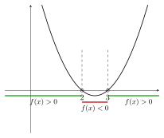
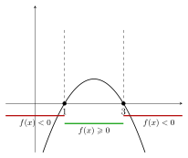
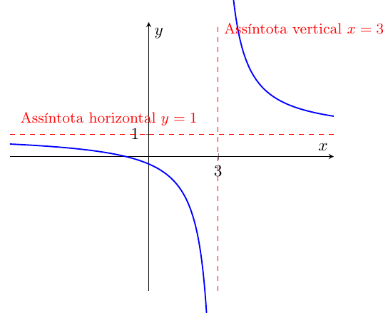
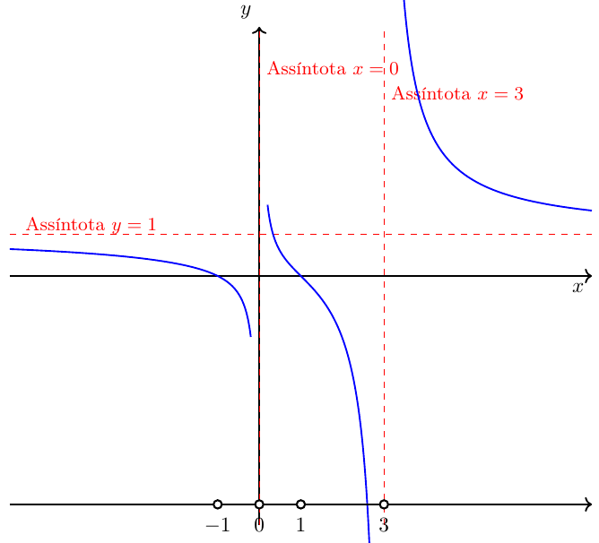

· [← Sumário do Curso](../index.qmd) · [← Cursos de Matemática](../../index.qmd) · [← Seção de Matemática](/posts/matematica/index.qmd)

🎯 **Post Anterior:** 👉 [1.2 Conjuntos Numéricos (Aprofundamento)](1.2-conjuntos-ap.qmd)

***

# Ordem em $\mathbb{R}$

::: {.callout-note title="📖 Definição — Ordem Estrita"}
Sejam $a,b \in \mathbb{R}$:
1. $a < b \iff b-a > 0$;
2. $a > b \iff a-b > 0$.
:::

## Exemplos
- $3<7$, pois $7-3=4>0$.

{fig-align="center" width="80%" fig-cap="Exemplo"}

- $-5<-2$, pois $-2-(-5)=3>0$.

{fig-align="center" width="80%" fig-cap="Exemplo"}

**Diagrama genérico:**

{fig-align="center" width="100%" fig-cap="Diagrama genérico"}

***

# Desigualdades Não-Estritas

::: {.callout-note title="📖 Definição — Ordem Não-Estrita"}
Sejam $a,b \in \mathbb{R}$:

1. $a \leqslant b \iff (a<b) \text{ ou } (a=b)$;
2. $a \geqslant b \iff (a>b) \text{ ou } (a=b)$.
:::

- $a<b$ e $a>b$: **desigualdades estritas**.  
- $a\leqslant b$ e $a\geqslant b$: **desigualdades não-estritas**.

***

# Teoremas Fundamentais da Ordem

::: {.callout-important title="📐 Teorema 1 — Sinais"}
1. $a>0 \iff a$ é positivo.  
2. $a<0 \iff a$ é negativo.
:::

::: {.callout-important title="📐 Teorema 2 — Transitividade"}
Se $a<b$ e $b<c$, então $a<c$.
:::

::: {.callout-important title="📐 Teorema 3 — Adição e Multiplicação"}
1. Se $a<b$, então $a+c<b+c$.  
2. Se $a<b$ e $c>0$, então $ac<bc$.  
3. Se $a<b$ e $c<0$, então $ac>bc$.
:::

::: {.callout-important title="📐 Teorema 4 — Soma de Desigualdades"}
Se $a<b$ e $c<d$, então $a+c<b+d$.
:::

***

# Cadeias de Desigualdades

Um número $x$ está **entre** $a$ e $b$ se $a<x<b$.  
Exemplo: $2<x<5$.  

Outras formas:  
- $a \leqslant x \leqslant b$ → intervalo fechado;  
- $a \leqslant x < b$, $a < x \leqslant b$ → intervalos semiabertos.

***

# Intervalos

## Intervalo aberto
\[(a,b) = \{x\in\mathbb{R}\mid a<x<b\}\]

{fig-align="center" width="100%" fig-cap="Intervalo aberto"}

## Intervalo fechado
\[[a,b] = \{x\in\mathbb{R}\mid a\leqslant x\leqslant b\}\]

{fig-align="center" width="100%" fig-cap="Intervalo fechado"}

## Semiabertos
- $(a,b] = \{x \mid a<x\leqslant b\}$  
{fig-align="center" width="100%" fig-cap="Intervalo semiaberto à esquerda"}

- $[a,b) = \{x \mid a\leqslant x<b\}$
{fig-align="center" width="100%" fig-cap="Intervalo semiaberto à direita"}

## Infinitos
- $(a,+\infty) = \{x \mid x>a\}$  
{fig-align="center" width="100%" fig-cap="Intervalo infinito ilimitado à direita"}

- $(-\infty,b) = \{x \mid x<b\}$  
{fig-align="center" width="100%" fig-cap="Intervalo infinito ilimitado à esquerda"}

- $[a,+\infty) = \{x \mid x\geqslant a\}$
{fig-align="center" width="100%" fig-cap="Intervalo infinito ilimitado à direita"}

- $(-\infty,b] = \{x \mid x\leqslant b\}$
{fig-align="center" width="100%" fig-cap="Intervalo infinito ilimitado à esquerda"}

- $(-\infty,+\infty)=\mathbb{R}$
{fig-align="center" width="100%" fig-cap="Reta real"}

***

# Inequações Lineares

Forma geral (com $a \neq 0$):

\[
\boxed{\, ax+b < c \,}
\]

\[
\boxed{\, ax+b \leqslant c \,}
\]

\[
\boxed{\, ax+b > c \,}
\]

\[
\boxed{\, ax+b \geqslant c \,}
\]

***

📌 **Observação importante:**  
- Se $a=0$, a inequação se reduz a uma **afirmação constante** ($b<c$, $b\leqslant c$, etc.), sem variável.  
- Se $a\neq 0$, podemos isolar $x$:

  - Para $a>0$, a ordem é preservada.  
  - Para $a<0$, a desigualdade inverte o sinal.

::: {.callout-note title="🧮 Exemplos — Inequações Lineares"}

## Casos com \(a>0\)

1. \(2x-3<5 \;\;\Rightarrow\;\; x<4\)  
   Solução: \((-\infty,4)\).

2. \(3x+1\leqslant 7 \;\;\Rightarrow\;\; x\leqslant 2\)  
   Solução: \((-\infty,2]\).

3. \(5x-4>11 \;\;\Rightarrow\;\; x>3\)  
   Solução: \((3,+\infty)\).

4. \(4x+2\geqslant 10 \;\;\Rightarrow\;\; x\geqslant 2\)  
   Solução: \([2,+\infty)\).

***

## Casos com \(a<0\)

5. \(-2x+3<7 \;\;\Rightarrow\;\; x>-2\)  
   Solução: \((-2,+\infty)\).

6. \(-3x+1\leqslant -8 \;\;\Rightarrow\;\; x\geqslant 3\)  
   Solução: \([3,+\infty)\).

7. \(-4x+5>1 \;\;\Rightarrow\;\; x<1\)  
   Solução: \((-\infty,1)\).

8. \(-x-2\geqslant 5 \;\;\Rightarrow\;\; x\leqslant -7\)  
   Solução: \((-\infty,-7]\).

***

📌 **Resumo importante:**  
- Se \(a>0\), a desigualdade **mantém** o sentido.  
- Se \(a<0\), a desigualdade **inverte** o sentido.  

:::

::: {.callout-note title="🧮 Exemplos resolvidos em detalhes"}

- **Exemplo 1:** \(2x-3<5\)  (coeficiente \(a>0\))

\[
\begin{aligned}
2x-3 &< 5 && \text{(dado)}\\
2x &< 5+3 = 8 && \text{(somar 3 dos dois lados)}\\
x &< \frac{8}{2} = 4 && \text{(dividir por 2>0, preserva o sinal)}
\end{aligned}
\]

✅ **Solução (intervalo):** \((-\infty,4)\).  
📌 **Checagem:** \(x=3 \Rightarrow 3<5\) (verdadeiro); \(x=4 \Rightarrow 5\not<5\) (falso).

***

- **Exemplo 5:** \(-2x+3<7\)  (coeficiente \(a<0\))

\[
\begin{aligned}
-2x+3 &< 7 && \text{(dado)}\\
-2x &< 7-3 = 4 && \text{(subtrair 3 dos dois lados)}\\
x &> \frac{4}{-2} = -2 && \text{(dividir por -2<0, \textbf{inverte} o sinal)}
\end{aligned}
\]

✅ **Solução (intervalo):** \((-2,+\infty)\).  
📌 **Checagem:** \(x=0 \Rightarrow 3<7\) (verdadeiro); \(x=-2 \Rightarrow 7\not<7\) (falso).

***

**Resumo didático:**  
- Somar/subtrair: mantém o sentido.  
- Multiplicar/dividir por número positivo: mantém o sentido.  
- Multiplicar/dividir por número negativo: **inverte** o sentido.

:::

***

# Inequações Quadráticas

Forma geral (com $a \neq 0$):

$$
\boxed{ax^2 +bx + c < 0}
$$

$$
\boxed{ax^2 +bx + c > 0}
$$

$$
\boxed{ax^2 +bx + c \leqslant 0}
$$

$$
\boxed{ax^2 +bx + c \geqslant 0}
$$

***

Resolver analisando a parábola $y=ax^2+bx+c$.

📌 **Exemplo 1:** $x^2-5x+6>0$  
- Raízes: $x=2,3$  
- Parábola abre para cima.  
- Sinal positivo fora de $(2,3)$.  
- Solução: $(-\infty,2)\cup(3,+\infty)$.

**Diagrama na reta real:**

{fig-align="center" width="100%" fig-cap="Exemplo"}

**Gráfico da parábola:**
{fig-align="center" width="100%" fig-cap="Estudo do sinal"}

***

📌 **Exemplo 1:** $x^2-5x+6>0$

::: {.callout-note title="🧮 Resolução detalhada"}

1. **Identificação:** trata-se de uma inequação quadrática com $a=1>0$, $b=-5$, $c=6$.

2. **Equação associada:**  
   \[
   x^2 - 5x + 6 = 0
   \]

3. **Discriminante (Δ):**  
   \[
   \Delta = b^2 - 4ac = (-5)^2 - 4\cdot 1 \cdot 6 = 25 - 24 = 1
   \]

4. **Raízes reais:**  
   \[
   x = \frac{-b \pm \sqrt{\Delta}}{2a} = \frac{5 \pm 1}{2}
   \]
   Logo, $x_1=2$ e $x_2=3$.

5. **Esboço da parábola:** como $a=1>0$, a parábola é **côncava para cima**.

6. **Sinal da parábola:**  
   - Para $x<2$, a parábola está acima do eixo ($f(x)>0$).  
   - Para $2<x<3$, a parábola está abaixo do eixo ($f(x)<0$).  
   - Para $x>3$, a parábola volta a ficar acima do eixo ($f(x)>0$).

7. **Conclusão (solução da inequação $f(x)>0$):**  
   \[
   x \in (-\infty,2)\cup(3,+\infty)
   \]

**Diagrama na reta real:**

{fig-align="center" width="100%" fig-cap="Exemplo"}

**Gráfico da parábola e estudo do sinal:**

{fig-align="center" width="100%" fig-cap="Estudo do sinal"}

:::

***

📌 **Exemplo 2:** $-x^2+4x-3 \geqslant 0$

::: {.callout-note title="🧮 Resolução detalhada"}

1. **Identificação:** inequação quadrática com $a=-1<0$, $b=4$, $c=-3$.  

2. **Equação associada:**  
   \[
   -x^2+4x-3=0
   \]

3. **Determinante (Δ):**  
   \[
   \Delta = b^2-4ac = (4)^2 - 4\cdot(-1)\cdot(-3) = 16 - 12 = 4
   \]

4. **Raízes reais:**  
   \[
   x=\frac{-b\pm\sqrt{\Delta}}{2a} = \frac{-4\pm 2}{-2}
   \]
   Logo, $x_1=1$ e $x_2=3$.

5. **Esboço da parábola:** como $a=-1<0$, a parábola é **côncava para baixo**.  
   Isso significa que a parábola está **acima do eixo $x$ entre as raízes** e **abaixo fora delas**.

6. **Sinal da parábola:**  
   - Para $x<1$, $f(x)<0$.  
   - Para $1\leqslant x\leqslant 3$, $f(x)\geqslant 0$.  
   - Para $x>3$, $f(x)<0$ novamente.

7. **Conclusão (solução da inequação $f(x)\geqslant 0$):**  
   \[
   x \in [1,3]
   \]

**Diagrama na reta real:**

{fig-align="center" width="100%" fig-cap="Exemplo com $a<0$"}

**Gráfico da parábola e estudo do sinal:**

{fig-align="center" width="100%" fig-cap="Parábola côncava para baixo e regiões de sinal"}

:::

***

# Inequações Produto

Forma geral: 

\[
\boxed{(x-a)(x-b) < 0}
\]  

\[
\boxed{(x-a)(x-b) > 0}
\]  

\[
\boxed{(x-a)(x-b) \leqslant 0}
\]  

\[
\boxed{(x-a)(x-b) \geqslant 0}
\]  

A solução é determinada pelo **sinal dos fatores** em cada intervalo definido pelas raízes.

***

📌 **Exemplo 1:** Produto positivo
Resolva:
\[
x(x-1) > 0
\]

::: {.callout-note collapse=true title="Resolução detalhada"}
- Raízes: \(x=0\) e \(x=1\).  
- Intervalos: \((-\infty,0),\ (0,1),\ (1,+\infty)\).  
- Teste de sinais:  
  - Para \(x<0\): ambos fatores negativos ⇒ produto positivo.  
  - Para \(0<x<1\): um positivo, outro negativo ⇒ produto negativo.  
  - Para \(x>1\): ambos positivos ⇒ produto positivo.  
  
{fig-align="center" width="100%" fig-cap="Exemplo $x(x-1) > 0$"}

✅ **Solução:** \((-\infty,0)\cup(1,+\infty)\).
:::

***

📌 **Exemplo 2:** Produto negativo
Resolva:
\[
(x-1)(x+2) < 0
\]

::: {.callout-note collapse=true title="Resolução detalhada"}
- Raízes: \(x=-2\) e \(x=1\).  
- Intervalos: \((-\infty,-2),\ (-2,1),\ (1,+\infty)\).  
- Teste de sinais:  
  - Para \(x<-2\): ambos negativos ⇒ produto positivo.  
  - Para \(-2<x<1\): sinais diferentes ⇒ produto negativo.  
  - Para \(x>1\): ambos positivos ⇒ produto positivo. 
  
{fig-align="center" width="100%" fig-cap="Exemplo $(x-1)(x+2) < 0$"} 

✅ **Solução:** \((-2,1)\).
:::

***

# Inequações Quociente

Forma geral:

\[
\boxed{\dfrac{f(x)}{g(x)} < 0,\quad g(x)\neq 0}
\]  

\[
\boxed{\dfrac{f(x)}{g(x)} > 0,\quad g(x)\neq 0}
\]  

\[
\boxed{\dfrac{f(x)}{g(x)} \leqslant 0,\quad g(x)\neq 0}
\]  

\[
\boxed{\dfrac{f(x)}{g(x)} \geqslant 0,\quad g(x)\neq 0}
\]  

A solução é determinada pela **tabela de sinais** de numerador e denominador.

***

## 📌 O que são Assíntotas?

::: {.callout-note title="📖 Definições"}
Seja uma função racional \(f(x)=\dfrac{p(x)}{q(x)}\).

- **Assíntota vertical:**  
  Dizemos que \(x=a\) é uma assíntota vertical se:
  - \(q(a)=0\) (o denominador se anula em \(a\)); e
  - \(p(a)\ne0\) (o numerador não se anula em \(a\)).  
  Nesse caso, \(f(x)\) **não está definida em \(x=a\)** e o gráfico da função
  se aproxima de uma linha vertical na reta \(x=a\).

- **Assíntota horizontal:**  
  Dizemos que \(y=L\) é uma assíntota horizontal se
  \[
  \lim_{x\to\pm\infty} f(x) = L.
  \]
  Isso significa que, para valores muito grandes (positivos ou negativos) de \(x\), o gráfico de \(f(x)\) se aproxima da reta horizontal \(y=L\).

📌 Estes conceitos serão explorados em detalhes no **Módulo de Funções Racionais** e, de forma mais rigorosa, no **Módulo de Limites**.
:::

::: {.callout-tip title="🔎 Observação"}
- Nos problemas de inequações racionais, os valores que **anulam o denominador** nunca pertencem à solução, pois a expressão fica indefinida.  
- Por isso, tratamos esses pontos como **fronteiras da análise de sinais**, e os chamamos de **assíntotas verticais**.  
- Já as assíntotas horizontais ajudam a descrever o **comportamento no infinito** de uma função racional.
:::

***

📌 **Exemplo 1:** Quociente positivo
Resolva:
\[
\frac{x+1}{x-3} > 0
\]

::: {.callout-note collapse=true title="Resolução detalhada"}
- Zeros: numerador \(x=-1\).  
- Assíntota: denominador \(x=3\).  
- Intervalos: \((-\infty,-1),\ (-1,3),\ (3,+\infty)\).  
- Sinais:  
  - \((-\infty,-1)\): ambos negativos ⇒ quociente positivo.  
  - \((-1,3)\): numerador positivo, denominador negativo ⇒ quociente negativo.  
  - \((3,+\infty)\): ambos positivos ⇒ quociente positivo.
  
{fig-align="center" width="100%" fig-cap="Exemplo $\frac{x+1}{x-3} > 0$"}

{fig-align="center" width="100%" fig-cap="Assíntotas"}

✅ **Solução:** \((-\infty,-1)\cup(3,+\infty)\).
:::

***

📌 **Exemplo 2:** Quociente com mais fatores
Resolva:
\[
\frac{x^2-1}{x^2-3x} > 0
\]

::: {.callout-note collapse=true title="Resolução detalhada"}
\[
\frac{(x-1)(x+1)}{x(x-3)} > 0, \quad x\neq 0,3.
\]

- Zeros/assíntotas: \(-1,\,0,\,1,\,3\).  
- Intervalos: \((-\infty,-1),\ (-1,0),\ (0,1),\ (1,3),\ (3,\infty)\).  
- Teste de sinais:  
  - \((-\infty,-1)\): positivo.  
  - \((-1,0)\): negativo.  
  - \((0,1)\): positivo.  
  - \((1,3)\): negativo.  
  - \((3,\infty)\): positivo.
  
{fig-align="center" width="100%" fig-cap="Exemplo $\frac{x^2-1}{x^2-3x} > 0$"}

{fig-align="center" width="100%" fig-cap="Assíntotas"}

✅ **Solução:** \((-\infty,-1)\cup(0,1)\cup(3,\infty)\).
:::

***

::: {.callout-note title="📝 Exercícios Propostos"}

1. Represente na reta real:  
   a) $(1,5]$  
   b) $(-\infty,-2)$  
   c) $[-3,3]$  

2. Resolva:  
   a) $3x+1\geqslant 7$  
   b) $x^2-4\leqslant 0$  
   c) $(x-1)(x-4)<0$  

:::

::: {.callout-important collapse=true title="✅ Gabarito"}

1. a) bolinha aberta em 1, fechada em 5  
   b) até $-2$ aberto  
   c) fechado de $-3$ a $3$  

2. a) $[2,+\infty)$  
   b) $[-2,2]$  
   c) $(1,4)$  

:::

***

## 🧠 Exercícios de Revisão

***

::: {.callout-note title="Exercício 1 — Desigualdade composta e intervalo"}
Resolva e escreva a solução em notação de intervalo:
\[
1<2x+3\le 9
\]

::: {.callout-note collapse=true title="Resolução comentada"}
\[
\begin{aligned}
1<2x+3\le 9 
&\iff 1-3<2x\le 9-3 \\
&\iff -2<2x\le 6 \\
&\iff -1<x\le 3 \quad (\text{dividir por }2>0)
\end{aligned}
\]
**Solução:** \((-1,3]\).
:::
:::

***

::: {.callout-note title="Exercício 2 — Coeficiente negativo (troca de sinal)"}
Resolva:
\[
-3x+5\ge 2
\]

::: {.callout-note collapse=true title="Resolução comentada"}
\[
\begin{aligned}
-3x+5\ge 2 
&\iff -3x\ge -3 \\
&\iff x\le 1 \quad (\text{dividir por }-3<0 \Rightarrow \text{inverte})
\end{aligned}
\]
**Solução:** \((-\infty,1]\).
:::
:::

***

::: {.callout-note title="Exercício 3 — Inequação quadrática fatorável (< 0)"}
Resolva:
\[
x^2-x-6<0
\]

::: {.callout-note collapse=true title="Resolução comentada"}
Fatorando: \(x^2-x-6=(x-3)(x+2)\).  
Raízes: \(x=-2\) e \(x=3\). Como \(a=1>0\), a parábola é **côncava para cima**.  
Logo, \(f(x)<0\) **entre** as raízes:
\[
x\in(-2,3).
\]
**Solução:** \((-2,3)\).
:::
:::

***

::: {.callout-note title="Exercício 4 — Inequação quadrática (raízes não inteiras) (≥ 0)"}
Resolva:
\[
2x^2+3x-2\ge 0
\]

::: {.callout-note collapse=true title="Resolução comentada"}
Discriminante: \(\Delta=b^2-4ac=3^2-4\cdot2\cdot(-2)=9+16=25\).  
Raízes:
\[
x=\frac{-3\pm\sqrt{25}}{2\cdot2}=\frac{-3\pm5}{4}\;\Rightarrow\;x_1=-2,\;x_2=\tfrac12.
\]
Com \(a=2>0\), a parábola é **côncava para cima**; então \(f(x)\ge 0\) **fora** do intervalo entre as raízes (e inclui as raízes porque é \(\geqslant\)):
\[
x\in(-\infty,-2]\cup\left[\tfrac12,\infty\right).
\]
**Solução:** \((-\infty,-2]\cup[0{,}5,\infty)\).
:::
:::

***

::: {.callout-note title="Exercício 5 — Operações com intervalos"}
Sejam \(A=(-\infty,4)\) e \(B=[1,7)\).  
(a) \(A\cap B\) \qquad (b) \(A\cup B\)

::: {.callout-note collapse=true title="Resolução comentada"}
- \(A\cap B\): pontos que estão **nos dois**.  
  \(A\) vai até \(4\) (aberto), \(B\) começa em \(1\) (fechado) e vai até \(7\) (aberto).  
  Interseção: de \(1\) até \(4\), incluindo \(1\) e **excluindo** \(4\): \([1,4)\).

- \(A\cup B\): pontos que estão **em pelo menos um**.  
  A união cobre de \(-\infty\) até \(7\) aberto (porque \(B\) já cobre \([1,7)\) e \(A\) cobre \((-\infty,4)\)): \((-\infty,7)\).

**Respostas:** (a) \([1,4)\) \qquad (b) \((-\infty,7)\).
:::
:::

***

::: {.callout-note title="Exercício 6 — Resolva as inequações abaixo."}

(a) Produto: \(x(x-1)>0\)

::: {.callout-note collapse=true title="Resolução comentada"}
Raízes em \(x=0\) e \(x=1\). Como o coeficiente líder é \(+1\), o produto é **positivo fora** do intervalo entre as raízes.  
✅ **Solução:** \((-\infty,0)\cup(1,\infty)\).
:::

***

(b) Produto: \((x-1)(x+2)<0\)

::: {.callout-note collapse=true title="Resolução comentada"}
Raízes em \(x=-2\) e \(x=1\). Coeficiente líder \(+1\) ⇒ negativo **entre** as raízes.  
✅ **Solução:** \((-2,1)\).
:::

***

(c) Quadrática: \(x^2+4x-21>0\)

::: {.callout-note collapse=true title="Resolução comentada"}
\(\Delta=4^2-4\cdot1\cdot(-21)=100\).  
Raízes: \(x=\tfrac{-4\pm10}{2}\Rightarrow x=-7,\,3\).  
Parábola abre para cima ⇒ \(>0\) **fora**.  
✅ **Solução:** \((-\infty,-7)\cup(3,\infty)\).
:::

***

(d) Quadrática: \(2x^2+x<3\)

::: {.callout-note collapse=true title="Resolução comentada"}
\(2x^2+x-3<0\).  
\(\Delta=1+24=25\).  
Raízes: \(x=\tfrac{-1\pm5}{4}\Rightarrow x=-\tfrac32,\,1\).  
\(<0\) **entre** as raízes.  
✅ **Solução:** \(\left(-\tfrac32,\,1\right)\).
:::

***

(e) Quadrática: \(4x^2+10x-6<0\)

::: {.callout-note collapse=true title="Resolução comentada"}
\(\Delta=10^2-4\cdot4\cdot(-6)=196\).  
Raízes: \(x=\tfrac{-10\pm14}{8}\Rightarrow x=-3,\,\tfrac12\).  
\(<0\) **entre** as raízes.  
✅ **Solução:** \((-3,\,\tfrac12)\).
:::

***

(f) Quadrática: \(x^2+2x+4>0\)

::: {.callout-note collapse=true title="Resolução comentada"}
\(\Delta=2^2-4\cdot1\cdot4=-12<0\) e \(a=1>0\) ⇒ a expressão é **sempre positiva**.  
✅ **Solução:** \(\mathbb{R}\).
:::

:::

***

::: {.callout-note title="Exercício 7 — Radicais reais (radicando ≥ 0)"}

(a) \(\sqrt{4-x^2}\)

::: {.callout-note collapse=true title="Resolução comentada"}
Precisamos \(4-x^2\ge0 \Rightarrow -2\le x\le 2\).  
✅ **Solução:** \([-2,2]\).
:::

***

(b) \(\dfrac{1}{\sqrt{4-3x}}\)

::: {.callout-note collapse=true title="Resolução comentada"}
O radicando deve ser **positivo** (e o denominador \(\ne0\)): \(4-3x>0 \Rightarrow x<\tfrac43\).  
✅ **Solução:** \((-\infty,\tfrac43)\).
:::

***

(c) \(\dfrac{1}{\sqrt{x^2-x-12}}\)

::: {.callout-note collapse=true title="Resolução comentada"}
Exigimos \(x^2-x-12>0\Rightarrow(x-4)(x+3)>0\) ⇒ fora das raízes.  
✅ **Solução:** \((-\infty,-3)\cup(4,\infty)\).
:::

:::

***

::: {.callout-note title="Exercício 8 — Positividade de funções racionais"}

(a) \(\dfrac{x}{x^2+4}>0\)

::: {.callout-note collapse=true title="Resolução comentada"}
Denominador \(x^2+4>0\) para todo \(x\). Sinal da fração = sinal de \(x\).  
✅ **Solução:** \((0,\infty)\).
:::

***

(b) \(\dfrac{x}{x^2-4}>0\)

::: {.callout-note collapse=true title="Resolução comentada"}
Críticos: \(x=0,\pm2\) (em \(\pm2\) é indefinida). Tabela de sinais ⇒ positivo em \((-2,0)\) e \((2,\infty)\).  
✅ **Solução:** \((-2,0)\cup(2,\infty)\).
:::

***

(c) \(\dfrac{x+1}{x-3}>0\)

::: {.callout-note collapse=true title="Resolução comentada"}
Zero: \(-1\). Assíntota: \(3\). Sinais por intervalos ⇒ \((-\infty,-1)\) e \((3,\infty)\).  
✅ **Solução:** \((-\infty,-1)\cup(3,\infty)\).
:::

***

(d) \(\dfrac{x^2-1}{x^2-3x}>0\)

::: {.callout-note collapse=true title="Resolução comentada"}
\(\dfrac{(x-1)(x+1)}{x(x-3)}>0\), com \(x\ne0,3\). Críticos: \(-1,0,1,3\).  
Sinais ⇒ \((-\infty,-1)\cup(0,1)\cup(3,\infty)\).  
✅ **Solução:** \((-\infty,-1)\cup(0,1)\cup(3,\infty)\).
:::

:::

***

::: {.callout-note title="Exercício 9 — Descrever e diagramar o conjunto (em $\mathbb{R}$)"}

(a) \(x^2<4\)

::: {.callout-note collapse=true title="Resolução comentada"}
\(-2<x<2\).  
✅ **Solução:** \((-2,2)\).
:::

***

(b) \(x^2+3x-4>0\)

::: {.callout-note collapse=true title="Resolução comentada"}
\((x+4)(x-1)>0\) ⇒ fora das raízes.  
✅ **Solução:** \((-\infty,-4)\cup(1,\infty)\).
:::

***

(c) \(x^2+6x+8\le0\)

::: {.callout-note collapse=true title="Resolução comentada"}
\((x+2)(x+4)\le0\) ⇒ entre as raízes, incluindo-as.  
✅ **Solução:** \([-4,-2]\).
:::

***

(d) \(x^2<5x+14\)

::: {.callout-note collapse=true title="Resolução comentada"}
\(x^2-5x-14<0\Rightarrow(x-7)(x+2)<0\) ⇒ entre as raízes.  
✅ **Solução:** \((-2,7)\).
:::

***

(e) \(2x^2>x+6\)

::: {.callout-note collapse=true title="Resolução comentada"}
\(2x^2-x-6>0\). \(\Delta=49\). Raízes: \(-\tfrac32\) e \(2\).  
\(>0\) **fora**.  
✅ **Solução:** \((-\infty,-\tfrac32)\cup(2,\infty)\).
:::

***

(f) \(6x^2+13x<5\)

::: {.callout-note collapse=true title="Resolução comentada"}
\(6x^2+13x-5<0\). \(\Delta=289\). Raízes: \(-\tfrac52\) e \(\tfrac13\).  
\(<0\) **entre**.  
✅ **Solução:** \((-\tfrac52,\,\tfrac13)\).
:::

***

(g) \(x^3+3x^2>10x\)

::: {.callout-note collapse=true title="Resolução comentada"}
\(x(x^2+3x-10)=x(x+5)(x-2)>0\).  
Sinais por intervalos com críticos \(-5,0,2\) ⇒  
✅ **Solução:** \((-5,0)\cup(2,\infty)\).
:::

:::

***

::: {.callout-note title="Exercício 10 — Resolva"}

(a) \(-4<2-x<7\)

::: {.callout-note collapse=true title="Resolução comentada"}
Somando \(-2\): \(-6<-x<5\). Multiplicando por \(-1\) (inverte): \(6>x>-5\).  
✅ **Solução:** \((-5,6)\).
:::

***

(b) \(\dfrac{2x-1}{x}<3\)

::: {.callout-note collapse=true title="Resolução comentada"}
\[
\frac{2x-1}{x}-3=\frac{-x-1}{x}<0 \ \Longleftrightarrow\ \frac{x+1}{x}>0.
\]
Críticos: \(-1,0\). Sinais ⇒ positivo em \((-\infty,-1)\) e \((0,\infty)\).  
✅ **Solução:** \((-\infty,-1)\cup(0,\infty)\).
:::

***

(c) \(\dfrac{x}{x+2}<1\)

::: {.callout-note collapse=true title="Resolução comentada"}
\[
\frac{x}{x+2}-1=\frac{-2}{x+2}<0 \ \Longleftrightarrow\ \frac{2}{x+2}>0
\]
(numerador \(>0\)) ⇒ \(x+2>0 \Rightarrow x>-2\), com \(x\ne-2\).  
✅ **Solução:** \((-2,\infty)\).
:::

:::

# 🔎 Quadro-Resumo — Módulo 1.3 (Ordem, Intervalos e Inequações)

***

::: {.callout-important title="📖 Definições de Ordem em $\mathbb{R}$"}
- \(a<b \iff b-a>0\); \quad \(a>b \iff a-b>0\).
- \(a\le b \iff (a<b \text{ ou } a=b)\); \quad \(a\ge b \iff (a>b \text{ ou } a=b)\).
- **Desigualdades estritas:** \(<,>\). **Não-estritas:** \(\le,\ge\).
:::

***

::: {.callout-note title="📏 Propriedades de Ordem — Uso rápido"}
- **Soma:** \(a<b \Rightarrow a+c<b+c\).
- **Produto por \(c>0\):** preserva o sentido.
- **Produto por \(c<0\):** inverte o sentido.
- **Transitividade:** se \(a<b\) e \(b<c\), então \(a<c\).
:::

***

::: {.callout-note title="📦 Intervalos e Notação"}
- Aberto: \((a,b)=\{x\mid a<x<b\}\).
- Fechado: \([a,b]=\{x\mid a\le x\le b\}\).
- Semiabertos: \((a,b],\ [a,b)\).
- Infinitos: \((a,\infty),\ (-\infty,b),\ [a,\infty),\ (-\infty,b]\).
:::

***

::: {.callout-important title="🧮 Inequações Lineares (com \(a\ne0\))"}
Forma geral: \(\boxed{\,ax+b\ \{<,\le,>,\ge\}\ c\,}\)

::: {.callout-note collapse=true title="Passo a passo"}
1) Isolar o termo \(ax\) (somando/subtraindo dos dois lados).  
2) Dividir por \(a\). **Se \(a<0\)**, **inverter** a desigualdade.  
3) Escrever a solução em intervalo e, se útil, testar um valor.  
:::
:::

***

::: {.callout-important title="🟦 Inequações Quadráticas"}
- Estudar o sinal de \(f(x)=ax^2+bx+c\) via **raízes** e **concavidade**.
- \(\Delta=b^2-4ac\).  
- Se \(a>0\): \(f(x)\) é \(>0\) **fora** das raízes e \(<0\) **entre**.  
- Se \(a<0\): comportamento invertido.

::: {.callout-note collapse=true title="Passo a passo"}
1) Resolver \(ax^2+bx+c=0\) (fatorar/BC).  
2) Marcar as raízes na reta e a concavidade (sinal de \(a\)).  
3) Escolher os intervalos que satisfazem \(>,\ge,<,\le\).  
4) **Incluir** as raízes se a desigualdade for não-estrita (\(\ge,\le\)).  
:::
:::

***

::: {.callout-note title="✖️ Inequações Produto"}
- Tipo: \((x-a)(x-b)\ \{<,>,\le,\ge\}\ 0\).  
- **Regra:** montar **tabela de sinais** dos fatores; o produto é \(+\) quando há número par de sinais negativos, e \(−\) quando ímpar.

::: {.callout-note collapse=true title="Exemplo enxuto"}
\(x(x-1)>0 \Rightarrow (-\infty,0)\cup(1,\infty)\).  
(Raízes \(0,1\); sinais: \(+,-,+\); queremos \(+\) → fora do intervalo.)  
:::
:::

***

::: {.callout-note title="➗ Inequações Quociente"}
- Tipo: \(\dfrac{f(x)}{g(x)}\ \{<,>,\le,\ge\}\ 0\), com \(g(x)\ne0\).  
- **Regra:** sinais **separam** por zeros de \(f\) (numerador) e por **assíntotas** \(g=0\) (excluídas!).  
- Quociente é \(+\) se numerador e denominador têm o **mesmo** sinal; \(−\) se têm sinais **opostos**.

::: {.callout-note collapse=true title="Exemplo enxuto"}
\(\dfrac{x+1}{x-3}>0 \Rightarrow (-\infty,-1)\cup(3,\infty)\).  
(Críticos \(-1\) [zero] e \(3\) [assíntota]; sinais: \(+,-,+\); queremos \(+\).)  
:::
:::

***

::: {.callout-tip title="🧰 Checklist rápido para resolver"}
- [ ] Identifique **tipo**: linear / quadrática / produto / quociente.  
- [ ] Encontre **pontos críticos** (raízes, assíntotas).  
- [ ] Faça **tabela de sinais** por intervalos.  
- [ ] Aplique a **regra do sinal** pedida (\(>,\ge,<,\le\)).  
- [ ] Decida **inclusão/exclusão** das bordas.  
- [ ] Escreva em **notação de intervalo** e **teste** um valor.
:::

***

::: {.callout-note title="⚠️ Erros comuns a evitar"}
- Esquecer de **inverter** a desigualdade ao dividir por número **negativo**.  
- **Incluir** assíntotas (\(g(x)=0\)) em quocientes.  
- Não verificar se a raiz entra na solução quando a relação é \(\ge\) ou \(\le\).  
- Perder pontos críticos ao simplificar fatores comuns (anote restrições antes!).  
:::

***

***
## 🧩 Quiz — Intervalos e Inequações

:::::{.question}
**Q1.** Ao multiplicar ou dividir uma inequação por um número negativo, devemos:

::::{.choices}
:::{.choice .correct-choice}
Inverter o sentido da desigualdade.
:::

:::{.choice}
Manter sempre o mesmo sentido da desigualdade.
:::

:::{.choice}
Trocar a inequação por uma igualdade.
:::

::::
:::::

:::::{.question}
**Q2.** Em uma inequação quociente, os valores que anulam o denominador devem ser:

::::{.choices}
:::{.choice .correct-choice}
Excluídos da solução, pois a expressão não está definida nesses pontos.
:::

:::{.choice}
Incluídos sempre que a desigualdade for não estrita.
:::

:::{.choice}
Tratados como raízes comuns do numerador.
:::

::::
:::::

:::::{.question}
**Q3.** A tabela de sinais serve principalmente para:

::::{.choices}

:::{.choice}
Substituir a resolução algébrica por tentativa aleatória.
:::

:::{.choice .correct-choice}
Analisar o sinal de uma expressão em intervalos determinados por pontos críticos.
:::

:::{.choice}
Eliminar a necessidade de considerar raízes e restrições.
:::

::::
:::::

***

# 🔗 Navegação

🎯 **Próximo Post:** 👉 [1.3 Valor Absoluto e Inequações Modulares (Aprofundamento)](1.3-valor-absoluto-AP.qmd)

· [← Sumário do Curso](../index.qmd) · [← Cursos de Matemática](../../index.qmd) · 🔝 [Topo](1.3-intervalos-inequacoes.qmd)

***

*Blog do Marcellini — Explorando a Matemática com Rigor e Beleza.*

:::{.callout-note}
Criado por Blog do Marcellini com ❤️ e código.
:::

