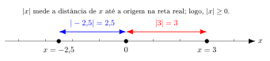

[← Voltar ao Sumário do Curso 🎓🧮](../index.qmd) · [← Cursos de Matemática](../../index.qmd) · [← Seção de Matemática](/posts/matematica/index.qmd)

🎯 **Post Anterior:** 👉 [1.3 Intervalos e Inequações](1.3-intervalos-inequacoes.qmd)

---

::: {.callout-note title="🎯 Objetivos de Aprendizagem"}
- Definir o valor absoluto (módulo) e interpretar geometricamente.  
- Apresentar propriedades fundamentais do módulo.  
- Introduzir e aplicar a desigualdade triangular.  
- Resolver inequações com módulo.  
- Fixar o aprendizado com exemplos e exercícios.
:::

---

# Definição de Módulo

::: {.callout-note title="📖 Definição"}
O **valor absoluto** (ou módulo) de um número real \(x\) é definido por:

\[
|x| =
\begin{cases}
 x, & \text{se } x \ge 0, \\
 -x, & \text{se } x < 0.
\end{cases}
\]
:::

---

# Interpretação Geométrica
- O módulo representa a **distância de \(x\) até a origem** na reta real.  
- Logo, \(|x|\ge 0\) para todo \(x \in \mathbb{R}\).

{fig-align="center" width="100%" fig-cap="Módulo"}

---

# Propriedades do Módulo

::: {.callout-important title="📐 Propriedades principais"}
1. \(|x|\ge 0\) e \(|x|=0 \iff x=0\).  
2. \(|xy|=|x|\cdot|y|\).  
3. \(|\dfrac{x}{y}|=\dfrac{|x|}{|y|}\), se \(y\ne0\).  
4. \(|x+y|\le |x|+|y|\) (**desigualdade triangular**).  
:::

::: {.callout-note collapse=true title="🧾 Demonstração das Propriedades"}
- **(1)** Por definição, \(|x|\) é a distância até a origem. Distância nunca é negativa, e só é nula quando o ponto é a própria origem (\(x=0\)).  

- **(2)** Sejam \(x,y\in\mathbb{R}\). Como o sinal de um produto é o produto dos sinais,  
  \[
  |xy| = (\pm x)\cdot(\pm y) = |x|\cdot |y|.
  \]

- **(3)** Para \(y\ne0\), basta dividir a igualdade da propriedade anterior:  
  \[
  |x/y| = \frac{|x|}{|y|}.
  \]

- **(4) Desigualdade triangular:** pela interpretação geométrica, \(|x+y|\) representa a distância entre \(0\) e \(x+y\). Essa distância nunca pode ser maior que a soma das distâncias de \(x\) e \(y\) até \(0\). Formalmente:  
  \[
  |x+y|^2 = (x+y)^2 = x^2 + 2xy + y^2 \le (|x|+|y|)^2,
  \]
  o que implica \(|x+y|\le |x|+|y|\).
:::

---

# Exemplos Resolvidos

::: {.callout-note title="🧮 Exemplo 1"}
Resolva:
\[
|x| = 3
\]

::: {.callout-note collapse=true title="Resolução"}
Por definição:  
- Se \(x\ge0\), então \(|x|=x=3 \Rightarrow x=3\).  
- Se \(x<0\), então \(|x|=-x=3 \Rightarrow x=-3\).  

✅ **Solução:** \(\{-3,3\}\).
:::
:::

---

::: {.callout-note title="🧮 Exemplo 2"}
Resolva:
\[
|x-2| < 5
\]

::: {.callout-note collapse=true title="Resolução"}
\(|x-2|<5 \iff -5 < x-2 < 5 \iff -3 < x < 7\).  

✅ **Solução:** \((-3,7)\).
:::
:::

---

# Inequações Modulares

::: {.callout-note title="📖 Definição"}
Uma **inequação modular** é uma inequação que envolve valor absoluto, como:
\[
|f(x)| \{<, \le, >, \ge\} a
\]
com \(a\ge0\).  
A resolução depende da definição por partes do módulo.
:::

---

# Exercícios Propostos

::: {.callout-note title="📝 Exercícios"}
1. Resolva: \(|x+1|\le4\).  
2. Resolva: \(|2x-3|>5\).  
3. Resolva: \(|x^2-1|<3\).  
4. Verifique se \(|x+y|\le |x|+|y|\) para \(x=2, y=-5\).  
:::

::: {.callout-important collapse=true title="✅ Gabarito"}
1. \(-5\le x+1\le4 \Rightarrow -6\le x\le3\).  
2. \(|2x-3|>5 \Rightarrow 2x-3>5\) ou \(2x-3<-5\) ⇒ \(x>4\) ou \(x<-1\).  
3. \(|x^2-1|<3 \Rightarrow -3<x^2-1<3 \Rightarrow -2<x^2<4\). Como \(x^2\ge0\), fica \(0\le x^2<4 \Rightarrow -2<x<2\).  
4. \(|2+(-5)|=|-3|=3\) e \(|2|+|{-5}|=2+5=7\). De fato, \(3\le7\).  
:::

---

# 🔗 Navegação
🎯 **Próximo Post:** 👉 [1.4 Funções] *(em produção)*

[← Sumário do Curso](../index.qmd) · [← Cursos de Matemática](../../index.qmd) · 🔝 [Topo](1.3-valor-absoluto-AP.qmd)

