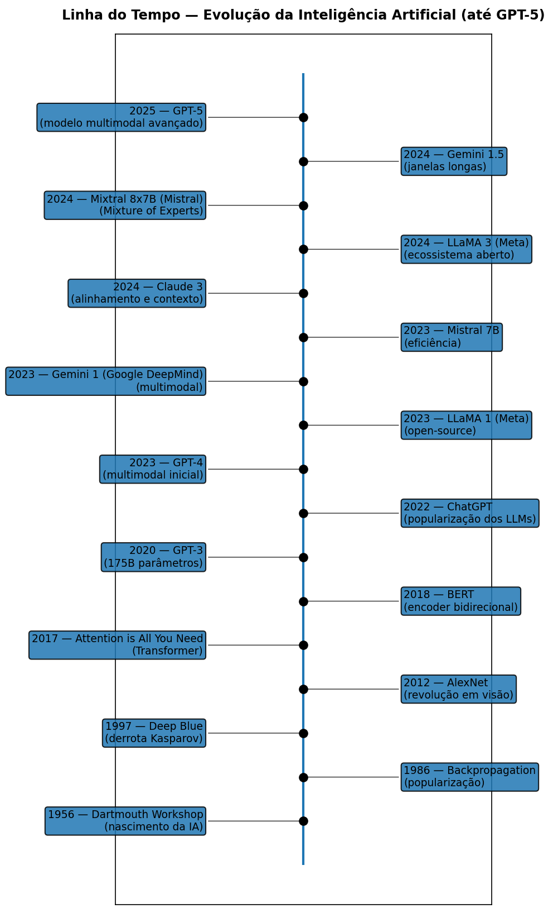

<!-- Breadcrumbs -->

· [← Seção de Programação](../index.qmd)

---

::: {.callout-note title="🤖 Inteligência Artificial — Série de LLMs"}
Tutoriais, exemplos práticos e aplicações de **IA e LLMs modernos**, como **GPT (OpenAI)**, **Claude (Anthropic)**, **Gemini (Google DeepMind)**, **LLaMA (Meta)** e **Mistral (França)** — integrados ao ecossistema **Quarto**.

Explore como esses modelos funcionam, suas bases em **redes neurais**,  
**Transformers**, **NLP**, **RNNs**, **BERT**, **LSTM**, **GRU** e a ascensão da **IA generativa**.
:::


# 🚀 Série Especial: Large Language Models (LLMs)

> Uma jornada para entender como funcionam os modelos que estão transformando o mundo digital.

---

## ✨ Overview

Os **Modelos de Linguagem de Grande Porte (LLMs)** são o coração da **IA generativa** moderna.  
Eles conseguem **entender e gerar texto**, escrever código, resumir documentos, criar roteiros, responder perguntas e muito mais.  

Nesta série você vai aprender:

- 🔹 O que são os LLMs e como nasceram.  
- 🔹 A evolução das redes neurais: de RNNs a Transformers.  
- 🔹 Como funciona o **mecanismo de atenção**.  
- 🔹 O processo de treinamento: pré-treinamento, fine-tuning e RLHF.  
- 🔹 Quais os desafios, limitações e riscos éticos.  
- 🔹 Aplicações práticas em educação, saúde, programação, negócios e arte.  
- 🔹 O futuro da IA: multimodalidade, democratização e especialização.  

---

## 📚 Série Completa

- [**O que é um Large Language Model (LLM)?**](llms/o-que-e-um-llm.qmd)  
- [**Atenção em Transformers: Q, K, V e Multi-Head Attention**](llms/atencao-transformers-qkv-mha.qmd)  
- [**Como os LLMs são treinados: Pré-treinamento, Fine-Tuning e RLHF**](llms/treinamento-pretrain-finetune-rlhf.qmd)  
- [**Desafios e Limitações dos LLMs**](llms/desafios-limitacoes.qmd)  
- [**Aplicações Práticas dos LLMs**](llms/aplicacoes-praticas.qmd)  
- [**O Futuro dos LLMs e da IA Generativa**](llms/futuro-ia-llms.qmd)  

---

## 🧭 Linha do tempo da IA

{fig-align="center" width="100%"}

:::: {.callout-important collapse="true" title="Código em Python - clique para expandir"}
```{python}
import matplotlib.pyplot as plt

# ---------- Dados ----------
marcos = [
    (1956, "Dartmouth Workshop\n(nascimento da IA)"),
    (1986, "Backpropagation\n(popularização)"),
    (1997, "Deep Blue\n(derrota Kasparov)"),
    (2012, "AlexNet\n(revolução em visão)"),
    (2017, "Attention is All You Need\n(Transformer)"),
    (2018, "BERT\n(encoder bidirecional)"),
    (2020, "GPT-3\n(175B parâmetros)"),
    (2022, "ChatGPT\n(popularização dos LLMs)"),
    (2023, "GPT-4\n(multimodal inicial)"),
    (2023, "LLaMA 1 (Meta)\n(open-source)"),
    (2023, "Gemini 1 (Google DeepMind)\n(multimodal)"),
    (2023, "Mistral 7B\n(eficiência)"),
    (2024, "Claude 3\n(alinhamento e contexto)"),
    (2024, "LLaMA 3 (Meta)\n(ecossistema aberto)"),
    (2024, "Mixtral 8x7B (Mistral)\n(Mixture of Experts)"),
    (2024, "Gemini 1.5\n(janelas longas)"),
    (2025, "GPT-5\n(modelo multimodal avançado)"),  # 👈 novo marco
]

# ---------- Amplia o espaçamento entre eventos ----------
# cria um eixo Y "esticado" multiplicando a posição de cada evento
gap = 3.2  # controle de espaçamento (↑ aumenta a distância entre rótulos)
anos = [i * gap for i in range(len(marcos))]
labels = [f"{ano} — {texto}" for ano, texto in marcos]

# ---------- Figura ----------
fig, ax = plt.subplots(figsize=(6.4, 11), dpi=150)

# linha do tempo central
ax.vlines(1, min(anos) - gap, max(anos) + gap, linewidth=2)
ax.plot([1]*len(anos), anos, 'o', markersize=7, color="black")

# ---------- Anotações ----------
for i, (y, text) in enumerate(zip(anos, labels)):
    is_left = (i % 2 == 0)
    x_text = 0.84 if is_left else 1.16
    ha = 'right' if is_left else 'left'
    ax.annotate(
        text,
        xy=(1, y),
        xytext=(x_text, y),
        textcoords='data',
        va='center',
        ha=ha,
        fontsize=9,
        arrowprops=dict(arrowstyle='-', lw=0.7, alpha=0.8),
        bbox=dict(boxstyle="round,pad=0.25", alpha=0.85)
    )

# ---------- Estilo geral ----------
ax.set_xlim(0.7, 1.3)
ax.set_xticks([])
ax.set_yticks([])
ax.set_title("Linha do Tempo — Evolução da Inteligência Artificial (até GPT-5)", fontsize=11.5, weight="bold", pad=12)
ax.set_ylabel("")

plt.tight_layout()
plt.savefig("images/ia-timeline-vertical.png", bbox_inches="tight")
plt.close()
```
:::

---

✍️ *Sugestões são bem-vindas!*  
Se quiser ver algum tema específico por aqui, abra um issue no repositório ou mande sua ideia 😉

---

# 🔗 Navegação

🎯 **Próximo Post:** 👉 [O que é um Large Language Model (LLM)?](llms/o-que-e-um-llm.qmd)

---

<!-- Breadcrumbs -->

· [← Seção de Programação](../index.qmd) · 🔝 [Topo](#top)

---

*Blog do Marcellini — Explorando a Matemática, a Estatística e a Física com Rigor e Beleza.*

:::{.callout-note}
*Criado por Blog do Marcellini com ❤️ e código.*
:::

# 🔗 Links Úteis

- 🧑‍🏫 [Sobre o Blog](/posts/pessoal/sobre-o-blog.qmd)
- 💻 <a href="https://github.com/marcellini-celso/blog-marcellini-pt.git" target="_blank">GitHub do Projeto</a>
- 📬 [Contato por E-mail](mailto:prof.marcellini@gmail.com)

