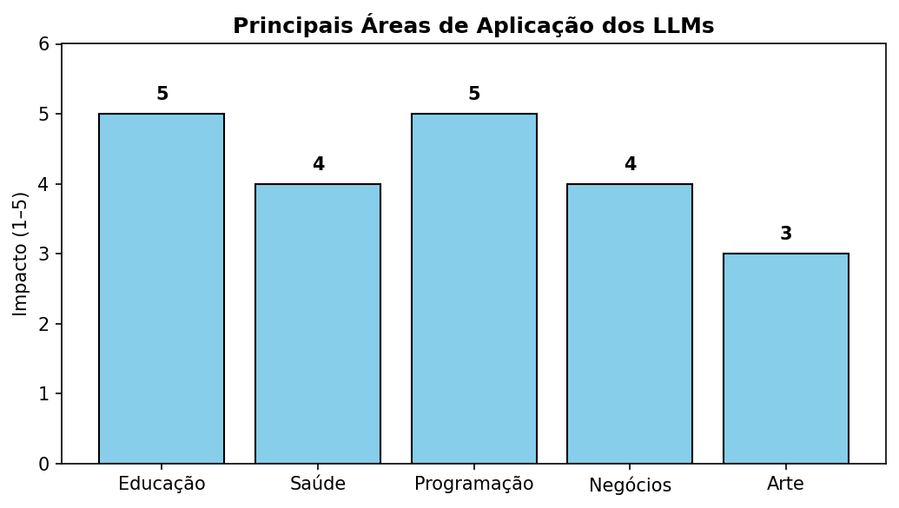

<!-- Breadcrumbs -->

· [← Série de LLMs 🤖](../index.qmd)

---

🎯 **Post Anterior:** 👉 [Desafios e Limitações dos LLMs](desafios-limitacoes.qmd)

---

## 🔷 Introdução

Os **Large Language Models (LLMs)** não são apenas uma curiosidade tecnológica.  
Eles já estão sendo usados em **diversas áreas da vida real**, impactando educação, saúde, programação, negócios, arte e muito mais.  

Neste post, vamos explorar suas **principais aplicações práticas**.

---

## 🎓 Educação

- Tutores virtuais que explicam conteúdos em linguagem simples.  
- Correção automática de exercícios e provas discursivas.  
- Geração de resumos e materiais de estudo personalizados.  

👉 Exemplo: um estudante pede *“Explique a Revolução Francesa em 5 pontos”* e recebe um resumo claro e objetivo.

::: {.callout-tip title="💡 Impacto na sala de aula"}
Os LLMs podem atuar como **assistentes pedagógicos**, mas não substituem o professor: eles ampliam a capacidade de personalizar e acelerar o aprendizado.
:::

---

## 🏥 Saúde

- Apoio a médicos com **resumos de prontuários**.  
- Auxílio no **diagnóstico preliminar** (atenção: sempre com supervisão humana).  
- Geração de relatórios clínicos de forma rápida.  

👉 Exemplo: transformar anotações médicas em um relatório padronizado para o hospital.

::: {.callout-warning title="⚠️ Limite importante"}
LLMs não são especialistas médicos. Eles podem **apoiar**, mas **jamais devem substituir** o julgamento clínico humano.
:::

---

## 💻 Programação

- Autocompletar código em tempo real (ex: GitHub Copilot).  
- Detecção de erros e sugestão de correções.  
- Geração de documentação técnica automaticamente.  

👉 Exemplo: pedir *“Escreva uma função em Python para calcular a média de uma lista”* e o modelo gera o código.

::: {.callout-note title="🧑‍💻 Benefício prático"}
Com LLMs, programadores podem focar em **resolver problemas complexos**, enquanto o modelo ajuda em **tarefas repetitivas e sintaxe**.
:::

---

## 📰 Negócios e Produtividade

- Resumo de e-mails e documentos longos.  
- Geração de relatórios de mercado.  
- Atendimento ao cliente via chatbots inteligentes.  

👉 Exemplo: uma empresa pode automatizar o **suporte inicial** a clientes 24h por dia.

::: {.callout-tip title="📊 Ganho real"}
Empresas relatam **redução de até 30% no tempo gasto com tarefas administrativas** quando adotam soluções baseadas em LLMs.
:::

---

## 🎨 Arte e Criatividade

- Criação de poesias, contos e roteiros.  
- Geração de ideias para design gráfico e publicidade.  
- Apoio a compositores e artistas visuais.  

👉 Exemplo: pedir *“Escreva uma música no estilo de samba sobre a Lua”*.

::: {.callout-note title="🎭 O papel da IA na arte"}
Os LLMs não substituem a **criatividade humana**, mas funcionam como **parceiros de brainstorming**, abrindo novos caminhos.
:::

---

## 🖼️ Resumo Visual das Aplicações

{fig-align="center" width="80%"}

:::: {.callout-important collapse="true" title="Código em Python — clique para expandir"}
```{python}
# Gera e salva "images/llm-applications.png"
from pathlib import Path
import matplotlib.pyplot as plt

out = Path("images"); out.mkdir(parents=True, exist_ok=True)
outfile = out / "llm-applications.png"

apps = ["Educação", "Saúde", "Programação", "Negócios", "Arte"]
values = [5, 4, 5, 4, 3]  # impacto simbólico (1 a 5)

fig, ax = plt.subplots(figsize=(7, 4), dpi=150)
bars = ax.bar(apps, values, color="skyblue", edgecolor="black")

ax.set_ylim(0, 6)
ax.set_ylabel("Impacto (1–5)")
ax.set_title("Principais Áreas de Aplicação dos LLMs", fontsize=12, weight="bold")

# labels nos topos
for bar in bars:
    yval = bar.get_height()
    ax.text(bar.get_x() + bar.get_width()/2, yval + 0.15, str(yval),
            ha="center", va="bottom", fontsize=10, weight="bold")

plt.tight_layout()
plt.savefig(outfile, bbox_inches="tight")
plt.close()
print(f"Figura salva em: {outfile}")
```
:::

---

## 📊 Tabela Comparativa

| Área | Exemplo | Impacto |
|------|---------|---------|
| **Educação** | Resumo automático de um capítulo de história | Personalização do estudo |
| **Saúde** | Gerar relatório clínico a partir de anotações | Agilidade para médicos |
| **Programação** | Autocompletar código no editor | Acelera o desenvolvimento |
| **Negócios** | Resumir 200 e-mails por dia | Economia de tempo |
| **Arte** | Criar poesia em segundos | Estímulo à criatividade |

## 🧩 Quiz — Teste rápido

:::::{.question}
**Q1.** Por que os LLMs não devem substituir médicos na saúde?

::::{.choices}
:::{.choice}
Porque ainda não conseguem resumir textos clínicos.
:::

:::{.choice .correct-choice}
Porque podem auxiliar, mas não substituem o julgamento humano especializado.
:::

:::{.choice}
Porque não conseguem acessar prontuários eletrônicos.
:::
::::
:::::

:::::{.question}
**Q2.** Em qual área os LLMs já reduziram tempo de trabalho administrativo?

::::{.choices}
:::{.choice}
Educação
:::

:::{.choice}
Arte
:::

:::{.choice .correct-choice}
Negócios
:::
::::
:::::

## 🔧 Analogia prática

::: {.callout-tip title="🧰 Os LLMs como uma caixa de ferramentas"}
Pense nos LLMs como uma **caixa de ferramentas universal**:  

- Na **educação**, eles são uma lupa para enxergar melhor.  
- Na **saúde**, um bloco de notas que organiza informações.  
- Na **programação**, uma chave de fenda automática.  
- Nos **negócios**, um assistente que organiza papéis.  
- Na **arte**, um pincel extra para criar novas ideias.  
:::


## ✅ Conclusão

Os **LLMs** já estão sendo aplicados em múltiplas áreas:

- **Educação:** personalizando aprendizado.  
- **Saúde:** auxiliando profissionais.  
- **Programação:** acelerando o desenvolvimento.  
- **Negócios:** aumentando a produtividade.  
- **Arte:** expandindo a criatividade humana.  

👉 O impacto tende a crescer cada vez mais, à medida que os modelos ficam mais eficientes e acessíveis.  

---

✍️ *Este post faz parte da série sobre LLMs no Blog do Marcellini.*  
No próximo capítulo, vamos discutir **o futuro dos LLMs e da IA generativa**: para onde essa tecnologia está indo? 🔮

---

# 🔗 Navegação

🎯 **Próximo Post:** 👉 [O Futuro dos LLMs e da IA Generativa](futuro-ia-llms.qmd)

---

<!-- Breadcrumbs -->

· [← Série de LLMs 🤖](../index.qmd) · 🔝 [Topo](#top)

---

*Blog do Marcellini — Explorando a Matemática, a Estatística e a Física com Rigor e Beleza.*

:::{.callout-note}
*Criado por Blog do Marcellini com ❤️ e código.*
:::

# 🔗 Links Úteis

- 🧑‍🏫 [Sobre o Blog](/posts/pessoal/sobre-o-blog.qmd)
- 💻 <a href="https://github.com/marcellini-celso/blog-marcellini-pt.git" target="_blank">GitHub do Projeto</a>
- 📬 [Contato por E-mail](mailto:prof.marcellini@gmail.com)

