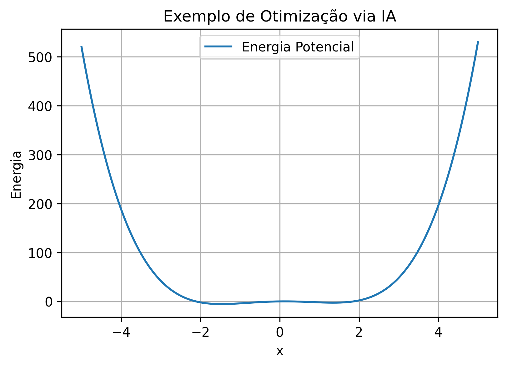

<!-- Breadcrumbs -->

· [← Série de LLMs 🤖](../index.qmd)

---

🎯 **Post Anterior:** 👉 [Desafios e Limitações dos LLMs](desafios-limitacoes.qmd)

---

## 🔷 Introdução

Os **Large Language Models (LLMs)** já estão sendo usados em **diversas áreas do cotidiano** — da educação à saúde, da programação à arte.  
Mais do que uma inovação técnica, eles representam uma **nova forma de pensar e produzir conhecimento**.  

Neste post, exploramos as **principais aplicações práticas dos LLMs**, seus impactos e desafios.

## 🎓 Educação

Os LLMs estão transformando a forma como ensinamos e aprendemos:

- 🧑‍🏫 **Tutores virtuais** que explicam conteúdos em linguagem acessível.  
- 🧾 **Correção automática** de exercícios e redações.  
- 📘 **Geração de resumos e materiais personalizados** conforme o nível do aluno.  

👉 *Exemplo:* um estudante pede *“Explique a Revolução Francesa em 5 tópicos”* — e recebe uma explicação clara, coerente e didática.

::: {.callout-tip title="💡 Impacto na sala de aula"}
Os LLMs atuam como **assistentes pedagógicos**, ampliando a personalização e o engajamento — **sem substituir o professor**.
:::

## 🧩 Quiz — LLMs na educação

:::::{.question}
**Q1.** Em contextos educacionais, um uso adequado de LLMs é:

::::{.choices}
:::{.choice}
Substituir completamente o professor.
:::

:::{.choice .correct-choice}
Apoiar explicações, gerar exercícios e personalizar materiais com supervisão humana.
:::

:::{.choice}
Eliminar a necessidade de estudo ativo por parte do aluno.
:::
::::
:::::

## 🏥 Saúde

Na medicina, os LLMs estão ajudando a **interpretar, resumir e correlacionar informações clínicas**:

- 🩺 Geração de **relatórios médicos** a partir de anotações.  
- 🔍 Apoio ao **diagnóstico preliminar** (com supervisão humana).  
- 📊 Resumo automático de **prontuários e resultados laboratoriais**.  

👉 *Exemplo:* um modelo transforma anotações médicas em um relatório padronizado para o sistema hospitalar.

::: {.callout-warning title="⚠️ Limite importante"}
LLMs não são especialistas médicos — eles **complementam** o trabalho humano, oferecendo agilidade e apoio, **nunca substituição**.
:::

## 💻 Programação

LLMs tornaram-se aliados indispensáveis dos desenvolvedores:

- 💬 **Autocompletar código** em tempo real (ex.: GitHub Copilot).  
- 🧩 **Detecção e correção de erros**.  
- 📚 **Geração automática de documentação e testes**.  

👉 *Exemplo:* pedir *“Escreva uma função em Python para calcular a média de uma lista”* — e o modelo retorna o código pronto.

::: {.callout-note title="🧑‍💻 Benefício prático"}
Com LLMs, programadores focam em **resolver problemas complexos**, enquanto o modelo lida com **sintaxe e tarefas repetitivas**.
:::

## 🔬 Ciência e Engenharia

Nos laboratórios e empresas, a IA se tornou ferramenta de **descoberta e otimização**:

- 🔬 **Descoberta de novos materiais** e compostos químicos.  
- 📈 **Simulações de risco e modelagem financeira**.  
- 📊 **Interpretação automática de papers científicos**.  

👉 *Exemplo:* uso de **LLMs especializados** (*FinGPT*, *SciPhi*) para resumir artigos e gerar insights técnicos.

{fig-align="center" width="95%" alt="Exemplo de simulação científica com IA"}

::: {.callout-important collapse=true title="🧮 Código em Python (clique para expandir) — gera a figura acima"}
```{python}
from pathlib import Path
import numpy as np
import matplotlib.pyplot as plt

Path("images").mkdir(exist_ok=True)
x = np.linspace(-5, 5, 200)
E = x**4 - 4*x**2 + x

fig, ax = plt.subplots(figsize=(6,4), dpi=300)
ax.plot(x, E, label="Energia Potencial")
ax.set_title("Exemplo de Otimização via IA")
ax.set_xlabel("x")
ax.set_ylabel("Energia")
ax.legend()
ax.grid(True)

fig.savefig("images/ia-simulacao-otimizacao.png", bbox_inches="tight")
plt.close()
print("Figura salva em: images/ia-simulacao-otimizacao.png")
```
:::


## 📰 Negócios e Produtividade

Nas empresas, os LLMs geram **ganhos de eficiência e automação**:

- 💬 **Resumos de e-mails e relatórios** longos.  
- 🤖 **Atendimento ao cliente automatizado** (chatbots).  
- 📈 **Geração de relatórios de mercado** e análise de tendências.  

::: {.callout-tip title="📊 Ganho real"}
Organizações relatam **redução de até 30% no tempo gasto com tarefas administrativas** ao integrar LLMs em seus fluxos de trabalho.
:::

## 🎨 Arte e Criatividade

Na cultura e nas indústrias criativas, os LLMs funcionam como **coprodutores de ideias**:

- ✍️ **Criação de textos, roteiros e poesias.**  
- 🎭 **Geração de ideias** para design e publicidade.  
- 🎵 **Apoio a compositores e artistas visuais.**  

👉 *Exemplo:* pedir *“Escreva uma música no estilo de samba sobre a Lua”* — e receber uma letra criativa pronta.

::: {.callout-note title="🎭 O papel da IA na arte"}
A IA **não substitui a criatividade humana** — ela **estimula novas perspectivas** e acelera o processo de criação.
:::

## 🌐 Sociedade e Ética

O avanço dos LLMs traz **novos desafios éticos e sociais**:

- 🔒 **Privacidade de dados** e regulamentação.  
- 🧠 **Desinformação** e manipulação digital (deepfakes).  
- ⚙️ **Automação de empregos** e requalificação profissional.  
- 🌱 **Sustentabilidade** no uso de energia para treinar grandes modelos.  

::: {.callout-warning title="⚖️ Questões éticas centrais"}
O equilíbrio entre **inovação e responsabilidade** será o grande desafio das próximas décadas da IA.
:::

## 🖼️ Resumo Visual das Aplicações

{fig-align="center" width="80%" alt="Resumo das aplicações dos LLMs"}

::: {.callout-important collapse=true title="📊 Código em Python (clique para expandir) — gera o gráfico acima"}
```{python}
from pathlib import Path
import matplotlib.pyplot as plt

out = Path("images"); out.mkdir(parents=True, exist_ok=True)
outfile = out / "llm-applications.png"

apps = ["Educação", "Saúde", "Programação", "Negócios", "Arte"]
values = [5, 4, 5, 4, 3]

fig, ax = plt.subplots(figsize=(7, 4), dpi=150)
bars = ax.bar(apps, values, color="skyblue", edgecolor="black")

ax.set_ylim(0, 6)
ax.set_ylabel("Impacto (1–5)")
ax.set_title("Principais Áreas de Aplicação dos LLMs", fontsize=12, weight="bold")

for bar in bars:
    y = bar.get_height()
    ax.text(bar.get_x() + bar.get_width()/2, y + 0.15, str(y),
            ha="center", va="bottom", fontsize=10, weight="bold")

plt.tight_layout()
plt.savefig(outfile, bbox_inches="tight")
plt.close()
print(f"Figura salva em: {outfile}")
```
:::

---

## 📊 Tabela Comparativa

| Área | Exemplo | Impacto |
|------|---------|---------|
| **Educação** | Resumo automático de um capítulo de história | Personalização do estudo |
| **Saúde** | Gerar relatório clínico a partir de anotações | Agilidade para médicos |
| **Programação** | Autocompletar código no editor | Acelera o desenvolvimento |
| **Negócios** | Resumir 200 e-mails por dia | Economia de tempo |
| **Arte** | Criar poesia em segundos | Estímulo à criatividade |


## 🧩 Quiz — Aplicações e limites

:::::{.question}
**Q2.** Por que os LLMs não devem substituir médicos na saúde?

::::{.choices}
:::{.choice}
Porque ainda não conseguem resumir textos clínicos.
:::

:::{.choice .correct-choice}
Porque podem auxiliar, mas não substituem o julgamento humano especializado.
:::

:::{.choice}
Porque não conseguem acessar prontuários eletrônicos.
:::
::::
:::::

:::::{.question}
**Q3.** Em qual área os LLMs já reduziram tempo de trabalho administrativo?

::::{.choices}
:::{.choice}
Educação
:::

:::{.choice}
Arte
:::

:::{.choice .correct-choice}
Negócios e produtividade
:::
::::
:::::

## 🔧 Analogia prática

::: {.callout-tip title="🧰 Os LLMs como uma caixa de ferramentas"}
Pense nos LLMs como uma **caixa de ferramentas universal**:  

- Na **educação**, eles são uma lupa para enxergar melhor.  
- Na **saúde**, um bloco de notas que organiza informações.  
- Na **programação**, uma chave de fenda automática.  
- Nos **negócios**, um assistente que organiza papéis.  
- Na **arte**, um pincel extra para criar novas ideias.  
:::

## ✅ Conclusão

Os **LLMs** já estão moldando o mundo real em várias frentes:

- **educação:** personalização do aprendizado e apoio ao professor;
- **saúde:** organização de informações clínicas e apoio administrativo;
- **programação:** geração de código, explicação de erros e documentação;
- **ciência e engenharia:** resumo de artigos, simulações e apoio à pesquisa;
- **negócios:** automação de relatórios, atendimento e análise de documentos;
- **arte:** apoio criativo em textos, roteiros, imagens e ideias.

O ponto central é que LLMs devem ser vistos como **ferramentas de apoio**, não como substitutos automáticos do julgamento humano.

Eles ampliam possibilidades, mas exigem revisão, responsabilidade e clareza sobre seus limites.

No próximo post, vamos explorar **o futuro dos LLMs e da IA generativa**: multimodalidade, agentes, especialização e democratização do acesso. 🔮

---

## 🔗 Navegação

🎯 **Post anterior:** 👉 [Desafios e Limitações dos LLMs](desafios-limitacoes.qmd)

🎯 **Próximo post:** 👉 [O Futuro dos LLMs e da IA Generativa](futuro-ia-llms.qmd)

---

<!-- Breadcrumbs -->

· [← Série de LLMs 🤖](../index.qmd) · 🔝 [Topo](#top)

---



:::{.callout-note}
*Criado por Blog do Marcellini com ❤ e código.*
:::

## 🔗 Links úteis

- [🧑‍🏫 Sobre o Blog](/posts/pessoal/sobre-o-blog.qmd)
- 💻 <a href="https://github.com/marcellini-celso/blog-marcellini-pt.git" target="_blank">GitHub do Projeto</a>
- 📬 [Contato por E-mail](mailto:prof.marcellini@gmail.com)
