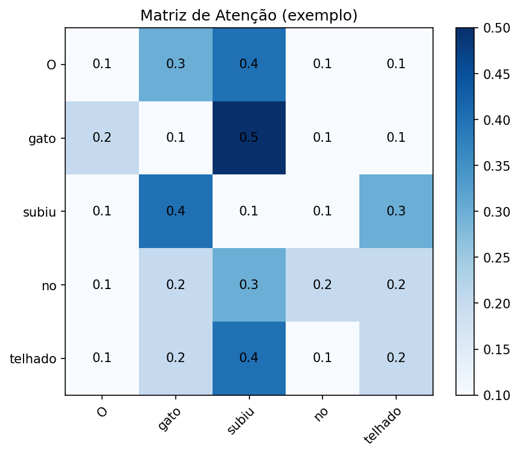
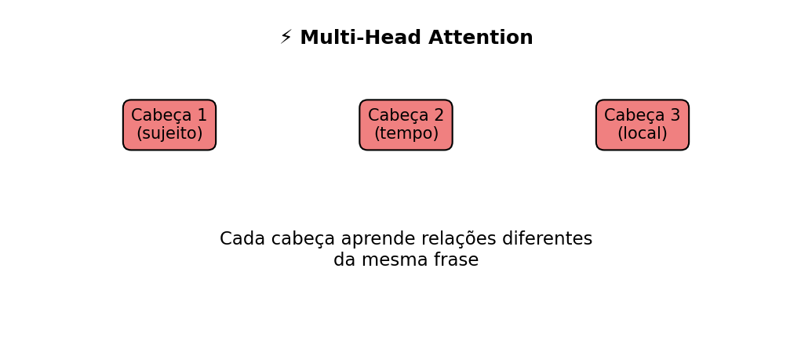

<!-- Breadcrumbs -->

· [← Série de LLMs 🤖](../index.qmd)

---

🎯 **Post Anterior:** 👉 [O que é um Large Language Model (LLM)?](o-que-e-um-llm.qmd)

## 🔷 Introdução

No post anterior vimos que o **Transformer** substituiu as RNNs pelo **mecanismo de atenção**, permitindo que o modelo olhe para todas as palavras de uma frase ao mesmo tempo.  

Agora vamos detalhar **como isso funciona internamente**, usando três conceitos-chave: **Query (Q), Key (K) e Value (V)**.  

## 🔑 Query, Key e Value (Q, K, V)

Podemos imaginar o mecanismo de atenção como uma **busca em biblioteca**:

- **Query (Q)**: é a pergunta que fazemos.  
- **Key (K)**: são as etiquetas que identificam os livros.  
- **Value (V)**: é o conteúdo do livro.  

👉 O modelo compara cada **Query** com todas as **Keys** para decidir **quais Values são mais importantes** para formar a saída.

Exemplo:  
Frase: **“O gato subiu no telhado.”**  

- Query: palavra atual (“subiu”).  
- Keys: todas as palavras da frase.  
- Values: significados associados a cada palavra.  
- Resultado: atenção maior em **“gato”** (quem subiu) e em **“telhado”** (onde subiu).  

## 🧩 Quiz — Q, K, V

:::::{.question}
**Q1.** No mecanismo de atenção, o papel da **Query (Q)** é:

::::{.choices}
:::{.choice}
Armazenar o significado das palavras.
:::

:::{.choice}
Ser a etiqueta usada para comparar palavras.
:::

:::{.choice .correct-choice}
Representar a "pergunta" que a rede faz para decidir relevância.
:::
::::
:::::

## 🧮 Fórmula Matemática

O cálculo da atenção é feito assim:

$$
\boxed{\text{Attention}(Q, K, V) = \text{Softmax}\left(\frac{QK^T}{\sqrt{d_k}}\right) V}
$$

Explicação:  

1. \( QK^T \): compara cada Query com todas as Keys (similaridade).  
2. \( \sqrt{d_k} \): normaliza para evitar números grandes demais.  
3. Softmax: transforma os resultados em **probabilidades** (pesos de atenção).  
4. Multiplicação por \( V \): gera a combinação ponderada dos valores mais relevantes.  

::: {.callout-tip title="💻 Implementação prática"}
Na prática, a equação da atenção não é escrita “à mão” toda vez. 
 
- O **Softmax** é uma função disponível em **NumPy**, **PyTorch** e **TensorFlow**.  
  - Ex.: `torch.nn.functional.softmax` (PyTorch) ou `tf.nn.softmax` (TensorFlow). 
 
- O **Attention** aparece implementado em módulos prontos, como  
  - `torch.nn.MultiheadAttention` (PyTorch),  
  - `tf.keras.layers.MultiHeadAttention` (TensorFlow).  

👉 Ou seja, a fórmula matemática é traduzida diretamente para funções de alto nível em Python, que por baixo dos panos usam **C++** e **CUDA** para acelerar os cálculos em CPU/GPU.
:::

::: {.callout-note title="⚡ O que é CUDA?"}
**CUDA (Compute Unified Device Architecture)** é uma tecnologia criada pela **NVIDIA** que permite usar a **GPU** (placa de vídeo) não apenas para gráficos, mas também para **cálculos matemáticos em paralelo**.  

👉 Por que isso importa para LLMs?  

- A fórmula da atenção envolve muitas **multiplicações de matrizes** grandes.  
- Enquanto a **CPU** faz poucas operações de cada vez, a **GPU** (via CUDA) pode rodar **milhares em paralelo**.  
- Resultado: treinar ou usar Transformers em **GPU + CUDA** é dezenas de vezes mais rápido que em CPU.

💡 Resumindo: CUDA é a “ponte” que permite que bibliotecas como **PyTorch** e **TensorFlow** usem a GPU para acelerar os cálculos de redes neurais.
:::

::: {.callout-tip title="🖥️ CPU vs GPU (com CUDA)"}
| Aspecto | CPU | GPU (com CUDA) |
|---------|-----|----------------|
| **Função principal** | Processamento geral do sistema | Gráficos 3D e cálculos paralelos |
| **Núcleos** | Poucos (4–16 núcleos potentes) | Milhares de núcleos menores |
| **Paralelismo** | Processa poucas tarefas ao mesmo tempo | Processa milhares de operações em paralelo |
| **Ideal para** | Tarefas sequenciais (planilha, navegador, apps comuns) | Tarefas massivas em paralelo (multiplicação de matrizes, deep learning, simulações) |
| **Velocidade em IA** | Lento em modelos grandes | Dezenas a centenas de vezes mais rápido |
| **Uso em LLMs** | Treino ou inferência ficam impraticáveis | Treino e inferência se tornam viáveis |

👉 Por isso, quando falamos de **Transformers e LLMs**, quase sempre citamos **GPU + CUDA**: sem essa combinação, treinar modelos seria extremamente lento em CPU.
:::

::: {.callout-note title="🍳 Analogia: CPU vs GPU na cozinha"}
- **CPU** é como um **chef gourmet**: tem poucas mãos, mas é excelente em seguir uma receita complicada do começo ao fim.  
- **GPU** é como uma **cozinha industrial** com **milhares de cozinheiros**: cada um faz um pedacinho simples em paralelo (picar, fritar, misturar).  

👉 Para treinar **LLMs**, o trabalho é repetitivo e massivo (milhões de multiplicações de matrizes).  

- Se você der isso ao chef sozinho (CPU), o jantar demora horas.  
- Se você usar a cozinha cheia de ajudantes (GPU + CUDA), tudo sai muito mais rápido.
:::

## 🧩 Quiz — CPU, GPU e CUDA

:::::{.question}
**Q2.** Por que GPUs com CUDA são importantes para Transformers e LLMs?

::::{.choices}
:::{.choice}
Porque eliminam a necessidade de dados de treinamento.
:::

:::{.choice .correct-choice}
Porque aceleram cálculos paralelos, como multiplicações de matrizes usadas na atenção.
:::

:::{.choice}
Porque substituem completamente o mecanismo de atenção.
:::
::::
:::::


## 🧩 Quiz — Fórmula da Atenção

:::::{.question}
**Q3.** Na fórmula da atenção, o papel do **Softmax** é:

::::{.choices}
:::{.choice}
Aumentar indefinidamente os valores numéricos.
:::

:::{.choice .correct-choice}
Transformar as similaridades em probabilidades (pesos de atenção).
:::

:::{.choice}
Multiplicar diretamente as Queries pelos Values.
:::
::::
:::::

## 🖼️ Exemplo Visual da Atenção

{fig-align="center" width="85%"}

:::: {.callout-important collapse="true" title="Código em Python (clique para expandir) -- gera a matriz acima"}
```{python}
# Gera e salva "images/atencao-heatmap.png"
from pathlib import Path
import matplotlib.pyplot as plt
import numpy as np

out = Path("images"); out.mkdir(parents=True, exist_ok=True)
outfile = out / "atencao-heatmap.png"

# palavras
words = ["O", "gato", "subiu", "no", "telhado"]
n = len(words)

# matriz de pesos de atenção (exemplo manual)
weights = np.array([
    [0.1, 0.3, 0.4, 0.1, 0.1],  # atenção da palavra "O"
    [0.2, 0.1, 0.5, 0.1, 0.1],  # atenção da palavra "gato"
    [0.1, 0.4, 0.1, 0.1, 0.3],  # atenção de "subiu"
    [0.1, 0.2, 0.3, 0.2, 0.2],  # atenção de "no"
    [0.1, 0.2, 0.4, 0.1, 0.2]   # atenção de "telhado"
])

fig, ax = plt.subplots(figsize=(6, 5), dpi=150)
im = ax.imshow(weights, cmap="Blues")

# labels
ax.set_xticks(range(n))
ax.set_yticks(range(n))
ax.set_xticklabels(words)
ax.set_yticklabels(words)
plt.setp(ax.get_xticklabels(), rotation=45, ha="right", rotation_mode="anchor")

# valores nas células
for i in range(n):
    for j in range(n):
        ax.text(j, i, f"{weights[i,j]:.1f}", ha="center", va="center", color="black")

ax.set_title("Matriz de Atenção (exemplo)")
fig.colorbar(im, ax=ax)
plt.tight_layout()
plt.savefig(outfile, bbox_inches="tight")
plt.close()
print(f"Figura salva em: {outfile}")
```
:::

## 🔀 Multi-Head Attention

O Transformer não usa apenas **uma** atenção, mas várias **em paralelo**:

- Cada “cabeça” aprende a focar em aspectos diferentes da frase.  
- Exemplo:  

  - Cabeça 1 → foca em **quem faz a ação**.  
  - Cabeça 2 → foca em **quando a ação acontece**.  
  - Cabeça 3 → foca em **onde a ação acontece**.  

👉 Isso enriquece a representação do texto, pois o modelo olha para múltiplas relações ao mesmo tempo.  

## 📊 Visualizando Multi-Head Attention

{fig-align="center" width="95%"}

:::: {.callout-important collapse="true" title="Código em Python (clique para expandir) -- gera a imagem acima"}
```{python}
# Gera e salva "images/multihead-attention.png"
from pathlib import Path
import matplotlib.pyplot as plt

out = Path("images"); out.mkdir(parents=True, exist_ok=True)
outfile = out / "multihead-attention.png"

heads = ["Cabeça 1\n(sujeito)", "Cabeça 2\n(tempo)", "Cabeça 3\n(local)"]
x = [0.2, 0.5, 0.8]
y = [0.6, 0.6, 0.6]

fig, ax = plt.subplots(figsize=(7, 3), dpi=150)

for i, head in enumerate(heads):
    ax.text(x[i], y[i], head, fontsize=10, ha="center",
            bbox=dict(boxstyle="round,pad=0.5", facecolor="lightcoral", edgecolor="black"))

ax.text(0.5, 0.9, "⚡ Multi-Head Attention", fontsize=12, weight="bold", ha="center")
ax.text(0.5, 0.2, "Cada cabeça aprende relações diferentes\nda mesma frase",
        fontsize=11, ha="center")

ax.axis("off")
plt.tight_layout()
plt.savefig(outfile, bbox_inches="tight")
plt.close()
print(f"Figura salva em: {outfile}")
```
:::


## 🧩 Quiz — Multi-Head Attention

:::::{.question}
**Q4.** Por que o Transformer usa várias cabeças de atenção (Multi-Head)?

::::{.choices}
:::{.choice}
Para acelerar o cálculo do Softmax.
:::

:::{.choice .correct-choice}
Porque cada cabeça aprende relações diferentes entre as palavras.
:::

:::{.choice}
Para substituir as Queries e Keys.
:::
::::
:::::

## ✅ Conclusão

O **mecanismo de atenção** é o núcleo do Transformer:

- **Q, K, V** permitem que o modelo decida quais palavras são relevantes;
- o **Softmax** transforma similaridades em pesos de atenção;
- a multiplicação por **V** gera uma combinação ponderada das informações;
- a **Multi-Head Attention** permite observar várias relações ao mesmo tempo.

Em essência, a atenção permite que o modelo não leia uma frase apenas em sequência, mas construa relações entre seus elementos. É por isso que Transformers conseguem lidar tão bem com contexto, dependências longas e padrões linguísticos complexos.

No próximo post, veremos como os LLMs são treinados: **pré-treinamento, fine-tuning e RLHF**.

---

## 🔗 Navegação

🎯 **Post Anterior:** 👉 [O que é um Large Language Model (LLM)?](o-que-e-um-llm.qmd)

🎯 **Próximo Post:** 👉 [Como os LLMs são treinados: Pré-treinamento, Fine-Tuning e RLHF](treinamento-pretrain-finetune-rlhf.qmd)

---

<!-- Breadcrumbs -->

· [← Série de LLMs 🤖](../index.qmd) · 🔝 [Topo](#top)

---



:::{.callout-note}
*Criado por Blog do Marcellini com ❤ e código.*
:::

## 🔗 Links úteis

- [🧑‍🏫 Sobre o Blog](/posts/pessoal/sobre-o-blog.qmd)
- 💻 <a href="https://github.com/marcellini-celso/blog-marcellini-pt.git" target="_blank">GitHub do Projeto</a>
- 📬 [Contato por E-mail](mailto:prof.marcellini@gmail.com)
