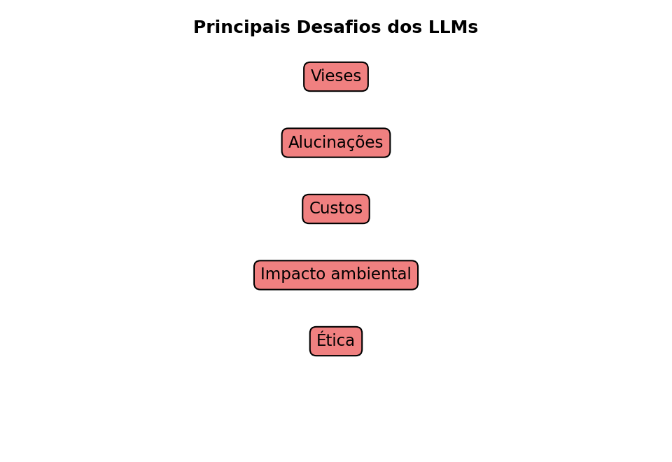

<!-- Breadcrumbs -->

· [← Série de LLMs 🤖](../index.qmd)

---

🎯 **Post Anterior:** 👉 [Como os LLMs são treinados: Pré-treinamento, Fine-Tuning e RLHF](treinamento-pretrain-finetune-rlhf.qmd)

---

## 🔷 Introdução

Os **Large Language Models (LLMs)** já transformaram a forma como interagimos com tecnologia.  
Mas, apesar de seu poder, eles **não são perfeitos**.  
Existem limitações técnicas, sociais e éticas que precisam ser entendidas.  

Neste post, vamos explorar os principais **desafios** dos LLMs.

---

## 🎭 Vieses nos modelos

LLMs aprendem a partir de textos da internet, que refletem **opiniões, preconceitos e desigualdades** humanas.  

- Isso significa que eles podem **reproduzir vieses** de gênero, raça, classe social etc.  
- Exemplo: associar profissões a um gênero específico.  

::: {.callout-tip title="💡 Exemplo prático"}
Se perguntarmos: *“Quem é um bom programador?”*  

- O modelo pode tender a responder “ele” em vez de “ela”, refletindo o desequilíbrio de representatividade nos dados de treino.  
:::

👉 Esse é um desafio ético e técnico, pois remover completamente os vieses é praticamente impossível.

---

## 🌀 Alucinações

LLMs são excelentes em gerar **texto fluente e coerente**, mas isso não garante que o conteúdo seja **verdadeiro**.  
Esse fenômeno é chamado de **alucinação** (*hallucination*).  

- O modelo pode inventar fatos, nomes, artigos e até códigos que **não existem**.  
- O texto parece confiável, mas é fabricado.  

### 📚 Exemplos práticos

- Criar **citações falsas**: “Segundo o artigo de Silva (2019)...” (mas o artigo não existe).  
- Inventar **datas históricas erradas**: dizer que a 2ª Guerra Mundial terminou em 1944.  
- Gerar **códigos que não compilam**, mas que parecem plausíveis.  

---

::: {.callout-warning title="⚠️ Por que os LLMs alucinam?"}
1. **Natureza estatística:** eles não “sabem fatos”, apenas calculam a próxima palavra provável.  
2. **Falta de memória real:** não têm acesso a uma base de dados estruturada, apenas padrões do treino.  
3. **Pressão para responder:** quando não sabem, ainda assim produzem um texto coerente.  
:::

---

### 🔬 Como a pesquisa tenta reduzir alucinações

- **Busca externa:** integrar LLMs com bancos de dados ou mecanismos de busca em tempo real.  
- **Verificação cruzada:** pedir que o modelo gere múltiplas respostas e compare.  
- **Instruções mais fortes:** técnicas de prompt engineering para limitar respostas “inventadas”.  
- **Treinamento específico:** usar bases com informações verificadas.  

---

::: {.callout-tip title="💡 Analogia simples"}
Imagine um **aluno criativo** numa prova:  

- Quando não sabe a resposta, inventa uma explicação convincente.  
- Pode enganar no primeiro olhar, mas não significa que está certo.  
Assim funcionam as **alucinações de LLMs**.  
:::

---

## 💰 Custos de Treinamento

Treinar um LLM moderno exige:

- **Centenas de GPUs ou TPUs** trabalhando em paralelo.  
- **Semanas ou meses** de processamento.  
- **Milhões de dólares** em infraestrutura.  

::: {.callout-note title="📊 Custo computacional"}
Modelos de fronteira podem exigir investimentos muito altos em hardware, energia, armazenamento, equipes técnicas e infraestrutura de nuvem.

Os valores exatos geralmente não são públicos, mas a ordem de grandeza ajuda a entender por que poucos grupos conseguem treinar modelos desse porte do zero.
:::

👉 Isso limita o acesso à tecnologia a poucas empresas gigantes, criando concentração de poder.

---

## 🌱 Impacto Ambiental

O consumo de energia dos LLMs é enorme.  

- Cada treinamento pode emitir **toneladas de CO₂**.  
- A manutenção (uso diário) também consome energia significativa em data centers.  

::: {.callout-tip title="🌍 Comparação ilustrativa"}
O impacto ambiental depende da matriz energética, do tamanho do modelo, do hardware usado e da frequência de uso.

Por isso, mais do que memorizar um número fixo, é importante entender que eficiência energética e uso responsável são partes centrais do debate.
:::

Isso levanta preocupações sobre **sustentabilidade** e a necessidade de **modelos mais eficientes**.

---

## ⚖️ Questões Éticas

- **Transparência:** usuários muitas vezes não sabem como o modelo foi treinado.  
- **Direitos autorais:** textos, músicas e imagens usados no treinamento podem ter copyright.  
- **Uso malicioso:** deepfakes, desinformação, fraudes automatizadas.  

::: {.callout-warning title="🚨 Dilema ético"}
A mesma tecnologia que gera **aulas acessíveis** pode ser usada para criar **propaganda enganosa** ou **desinformação política**.  
:::

👉 A ética da IA é um campo em rápida evolução, e os LLMs estão no centro do debate.

## 🧩 Quiz — Vieses e uso responsável

:::::{.question}
**Q1.** Quando dizemos que um LLM pode reproduzir **vieses**, queremos dizer que ele pode:

::::{.choices}
:::{.choice}
Resolver qualquer problema matemático sem erro.
:::

:::{.choice .correct-choice}
Repetir padrões, estereótipos ou desigualdades presentes nos dados de treinamento.
:::

:::{.choice}
Eliminar automaticamente todos os preconceitos humanos.
:::
::::
:::::

:::::{.question}
**Q2.** Um uso responsável de LLMs exige:

::::{.choices}
:::{.choice}
Aceitar toda resposta gerada como verdadeira.
:::

:::{.choice}
Evitar qualquer revisão humana.
:::

:::{.choice .correct-choice}
Verificar informações importantes, considerar riscos e manter supervisão humana.
:::
::::
:::::

---

## 🖼️ Resumo Visual

{fig-align="center" width="90%"}

:::: {.callout-important collapse="true" title="Código em Python (clique para expandir) -- gera a imagem  acima"}
```{python}
# Gera e salva "images/llm-challenges.png"
from pathlib import Path
import matplotlib.pyplot as plt

out = Path("images"); out.mkdir(parents=True, exist_ok=True)
outfile = out / "llm-challenges.png"

fig, ax = plt.subplots(figsize=(6.5, 4.5), dpi=150)

items = [
    "Vieses",
    "Alucinações",
    "Custos",
    "Impacto ambiental",
    "Ética"
]

# posição vertical para as caixas
ys = [0.85, 0.70, 0.55, 0.40, 0.25]

for text, y in zip(items, ys):
    ax.text(0.5, y, text, fontsize=11, ha="center", va="center",
            bbox=dict(boxstyle="round,pad=0.4", facecolor="lightcoral", edgecolor="black"))

ax.text(0.5, 0.95, "Principais Desafios dos LLMs", ha="center", fontsize=12, weight="bold")

ax.set_xlim(0, 1)
ax.set_ylim(0, 1)
ax.axis("off")

plt.tight_layout()
plt.savefig(outfile, bbox_inches="tight")
plt.close()
print(f"Figura salva em: {outfile}")
```
:::

---

## 🧩 Quiz — Teste seus conhecimentos

:::::{.question}
**Q3.** O que significa “alucinação” em um LLM?

::::{.choices}
:::{.choice}
Quando o modelo reproduz vieses sociais.
:::

:::{.choice .correct-choice}
Quando o modelo inventa informações falsas, mas de forma coerente.
:::

:::{.choice}
Quando o modelo consome muita energia para treinar.
:::
::::
:::::

:::::{.question}
**Q4.** Qual dos pontos abaixo está ligado ao **impacto ambiental** dos LLMs?

::::{.choices}
:::{.choice}
Tendência de associar estereótipos.
:::

:::{.choice}
Geração de respostas falsas.
:::

:::{.choice .correct-choice}
O consumo de energia e emissão de CO₂ em data centers.
:::
::::
:::::

## 📊 Resumo Comparativo

| Desafio | Descrição | Exemplo |
|---------|-----------|---------|
| **Vieses** | Reproduzem preconceitos sociais | Associar profissões a um gênero |
| **Alucinações** | Inventam fatos falsos | Citar artigo inexistente |
| **Custos** | Alto gasto com GPUs, energia e infraestrutura | Treinamentos de fronteira podem custar milhões de dólares |
| **Impacto ambiental** | Consumo elevado de energia e recursos | Data centers exigem energia, resfriamento e infraestrutura |
| **Ética** | Questões de uso e copyright | Deepfakes, desinformação |


## ✅ Conclusão

Os LLMs são uma **tecnologia transformadora**, mas trazem riscos e responsabilidades.

Eles podem:

- reproduzir **vieses sociais**;
- gerar **alucinações**;
- exigir grande quantidade de energia e infraestrutura;
- concentrar poder tecnológico em poucas organizações;
- levantar questões éticas sobre autoria, privacidade, desinformação e responsabilidade.

Isso não significa que devemos rejeitar a tecnologia. Significa que devemos usá-la com **critério**, **verificação** e **supervisão humana**.

O futuro da IA depende não apenas de modelos mais capazes, mas também de instituições, usuários, pesquisadores e educadores capazes de compreender seus limites.

No próximo post, vamos explorar as **aplicações práticas dos LLMs**: educação, saúde, programação, arte e muito mais. 🚀

---

## 🔗 Navegação

🎯 **Post anterior:** 👉 [Como os LLMs são treinados: Pré-treinamento, Fine-Tuning e RLHF](treinamento-pretrain-finetune-rlhf.qmd)
🎯 **Próximo post:** 👉 [Aplicações Práticas dos LLMs](aplicacoes-praticas.qmd)

---

<!-- Breadcrumbs -->

· [← Série de LLMs 🤖](../index.qmd) · 🔝 [Topo](#top)

---



:::{.callout-note}
*Criado por Blog do Marcellini com ❤ e código.*
:::

## 🔗 Links úteis

- [🧑‍🏫 Sobre o Blog](/posts/pessoal/sobre-o-blog.qmd)
- 💻 <a href="https://github.com/marcellini-celso/blog-marcellini-pt.git" target="_blank">GitHub do Projeto</a>
- 📬 [Contato por E-mail](mailto:prof.marcellini@gmail.com)
