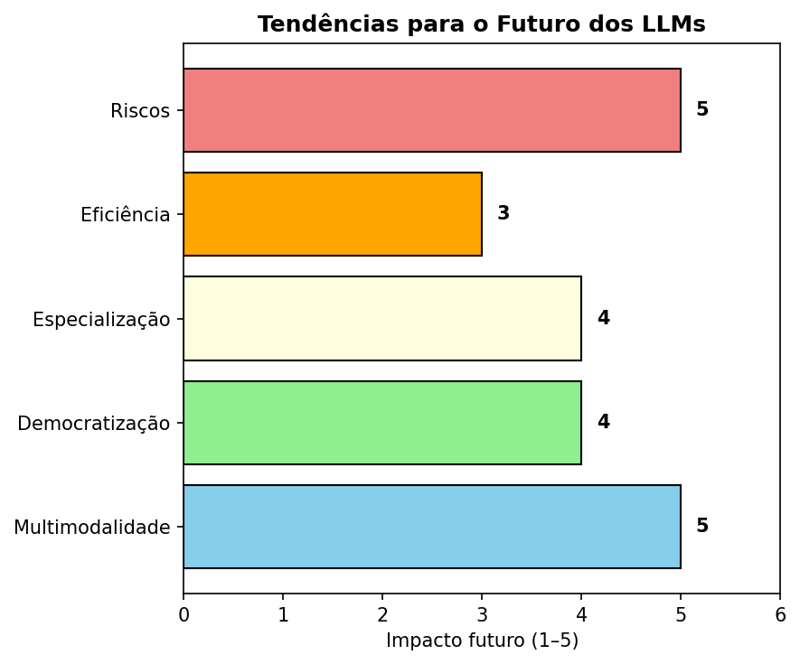

<!-- Breadcrumbs -->

· [← Série de LLMs 🤖](../index.qmd)

---

🎯 **Post Anterior:** 👉 [Aplicações Práticas dos LLMs](aplicacoes-praticas.qmd)

---

## 🔷 Introdução

Os **Large Language Models (LLMs)** e a **IA generativa** já estão mudando a forma como trabalhamos, aprendemos e criamos.  
Mas o que esperar do futuro?  

Neste post, vamos explorar **tendências e direções possíveis** para essa tecnologia.

---

## 🖼️ Multimodalidade

Até agora, a maioria dos LLMs trabalha apenas com **texto**.  
O futuro aponta para modelos **multimodais**, que integram:

- Texto  
- Imagem  
- Áudio  
- Vídeo  
- Dados estruturados  

👉 Exemplo: pedir a um modelo que analise **uma radiografia (imagem)**, explique em **texto** e sugira **tratamentos (base de dados médicos)**.

---

## 🌍 Democratização da IA

Hoje, os modelos de ponta estão concentrados em poucas empresas.  
No futuro, podemos ter:

- **Modelos open-source mais poderosos** (como LLaMA e Mistral).  
- **Infraestruturas acessíveis** para pequenas empresas e universidades.  
- **IA personalizada** rodando localmente em dispositivos pessoais.  

👉 Isso pode tornar a IA mais inclusiva e menos centralizada.

---

## 🧩 Especialização

LLMs genéricos são úteis, mas o futuro deve trazer **modelos especializados** em áreas como:

- Medicina  
- Direito  
- Educação  
- Engenharia  
- Finanças  

👉 Exemplo: um **LLM jurídico** treinado em legislação nacional para auxiliar advogados.

---

## ⚡ Eficiência e Sustentabilidade

O impacto ambiental e os custos de treinar modelos gigantes são altos.  
O futuro deve trazer:

- **Modelos menores e mais rápidos**.  
- **Técnicas de compressão e quantização**.  
- **Treinamento mais sustentável**.  

👉 Tornando o acesso mais barato e ecológico.

---

## ⚠️ Riscos Futuros

Junto com os avanços, também crescem os desafios:

- **Desinformação em larga escala** (deepfakes e fake news).  
- **Automação excessiva** substituindo empregos sem preparo social.  
- **Dependência tecnológica** cada vez maior.  
- **Questões éticas e regulatórias** em disputa global.  

---

## 🖼️ Resumo Visual

{fig-align="center" width="80%"}

:::: {.callout-important collapse="true" title="Código em Python — clique para expandir"}
```{python}
# Gera e salva "images/llm-future-trends.png"
from pathlib import Path
import matplotlib.pyplot as plt

out = Path("images"); out.mkdir(parents=True, exist_ok=True)
outfile = out / "llm-future-trends.png"

items = [
    "Multimodalidade",
    "Democratização",
    "Especialização",
    "Eficiência",
    "Riscos"
]

values = [5, 4, 4, 3, 5]
colors = ["skyblue", "lightgreen", "lightyellow", "orange", "lightcoral"]

fig, ax = plt.subplots(figsize=(6, 5), dpi=150)
bars = ax.barh(items, values, color=colors, edgecolor="black")

ax.set_xlim(0, 6)
ax.set_xlabel("Impacto futuro (1–5)")
ax.set_title("Tendências para o Futuro dos LLMs", fontsize=12, weight="bold")

# labels ao lado das barras
for bar in bars:
    w = bar.get_width()
    ax.text(w + 0.15, bar.get_y() + bar.get_height()/2,
            str(int(w)), va="center", fontsize=10, weight="bold")

plt.tight_layout()
plt.savefig(outfile, bbox_inches="tight")
plt.close()
print(f"Figura salva em: {outfile}")
```
:::

---

## ✅ Conclusão

O futuro dos **LLMs e da IA generativa** aponta para:

- **Modelos multimodais** capazes de integrar diferentes tipos de dados.  
- **Maior democratização**, com acesso aberto e local.  
- **Especialização por áreas**, tornando-os mais úteis em contextos reais.  
- **Busca por eficiência**, reduzindo custos e impacto ambiental.  
- **Novos riscos éticos e sociais**, que precisarão de regulamentação e uso responsável.  

👉 Estamos apenas no começo de uma revolução tecnológica que deve transformar profundamente a sociedade.  

---

✍️ *Este post encerra a primeira série sobre LLMs no Blog do Marcellini.*  
Nos próximos conteúdos, vamos mergulhar em aplicações práticas de IA em áreas específicas, como **educação, saúde e ciência**. 🚀

---

<!-- Breadcrumbs -->

· [← Série de LLMs 🤖](../index.qmd) · 🔝 [Topo](#top)

---

*Blog do Marcellini — Explorando a Matemática, a Estatística e a Física com Rigor e Beleza.*

:::{.callout-note}
*Criado por Blog do Marcellini com ❤️ e código.*
:::

# 🔗 Links Úteis

- 🧑‍🏫 [Sobre o Blog](/posts/pessoal/sobre-o-blog.qmd)
- 💻 <a href="https://github.com/marcellini-celso/blog-marcellini-pt.git" target="_blank">GitHub do Projeto</a>
- 📬 [Contato por E-mail](mailto:prof.marcellini@gmail.com)

