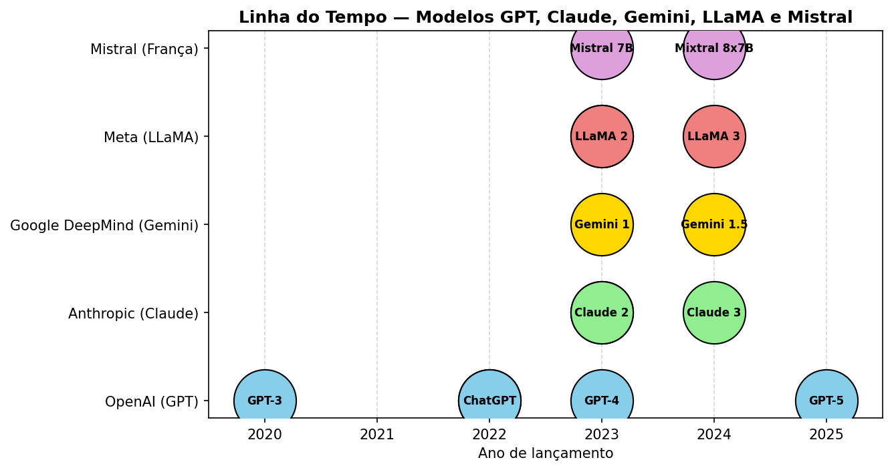
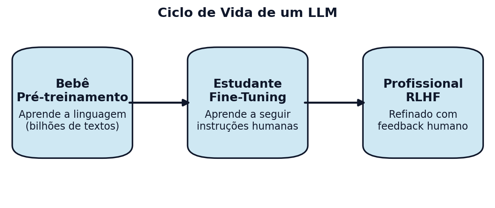

<!-- Breadcrumbs -->

· [← Série de LLMs 🤖](../index.qmd)

---

## 🔷 Introdução

Um **Large Language Model (LLM)** — em português, **Modelo de Linguagem de Grande Porte** — é um tipo de **rede neural** treinada em **grandes volumes de texto** para aprender padrões da linguagem humana.  

Ele funciona prevendo a **próxima palavra** (ou token) em uma sequência.  
Parece simples, mas é isso que permite que ele:

- escreva textos coerentes,  
- traduza idiomas,  
- responda perguntas,  
- resuma informações,  
- e até **escreva código**.  

::: {.callout-note title="💡 Exemplo rápido"}
Quando você começa a digitar no celular **“Bom dia, como você…”**,  
o teclado já sugere **“está?”**.  
Esse é um mini-LLM atuando, mas em escala muito menor que os modelos atuais.
:::

## 🧠 O que é uma Rede Neural?

Uma **rede neural artificial** é um modelo inspirado no cérebro humano.  

- Imagine uma rede de **neurônios artificiais** que recebem, processam e transmitem informações.  
- Esses neurônios são organizados em **camadas**:

| Camada | Função | Exemplo |
|--------|--------|---------|
| **Entrada** | Recebe os dados | Texto → números (tokens) |
| **Ocultas** | Aprendem padrões | Reconhecer que “gato” e “felino” são relacionados |
| **Saída** | Gera o resultado | Prevê a próxima palavra |

## 🧩 Quiz — Redes Neurais

:::::{.question}
**Q1.** Em uma rede neural, a camada de **entrada** tem como papel:

::::{.choices}
:::{.choice}
Fazer previsões sobre a próxima palavra.
:::

:::{.choice .correct-choice}
Converter os dados originais (texto → números).
:::

:::{.choice}
Aprender padrões ocultos no texto.
:::
::::
:::::

## 📚 O que é NLP?

**NLP (Natural Language Processing)**, ou **Processamento de Linguagem Natural**, é a área que estuda como computadores podem **entender e gerar linguagem humana**.  

### Exemplos no dia a dia:

- **Google Tradutor** → tradução automática.  
- **Chatbots de atendimento** → responder perguntas comuns.  
- **Análise de sentimentos** → detectar se um comentário é positivo ou negativo.  
- **Busca inteligente** → encontrar documentos sem precisar da palavra exata.  

::: {.callout-tip title="🔍 Insight"}
Os **LLMs** são o **estado da arte em NLP**, porque aprendem **muitas tarefas ao mesmo tempo**, sem precisar ser reprogramados para cada caso.
:::

## 🧩 Quiz — NLP

:::::{.question}
**Q2.** Qual das opções **não é** um exemplo de NLP?

::::{.choices}
:::{.choice}
Tradutor automático.
:::

:::{.choice}
Análise de sentimentos.
:::

:::{.choice .correct-choice}
Ordenar arquivos por tamanho no computador.
:::
::::
:::::

## 🌀 Antes dos Transformers: as RNNs

As **RNNs (Redes Neurais Recorrentes)** foram a primeira grande aposta para lidar com **sequências de texto**.  

- Elas liam as palavras **uma de cada vez**, lembrando o que já foi visto.  
- Exemplo: “O gato subiu no…” → prevê **“telhado”**.

Mas tinham problemas:  

1. **Memória curta** (frases longas eram difíceis).  
2. **Treinamento lento** (sequencial).  
3. Problemas de **gradiente desaparecendo ou explodindo**.

## 🧩 Quiz — RNN

:::::{.question}
**Q3.** Qual é a principal dificuldade das RNNs?

::::{.choices}
:::{.choice}
Fazem previsões muito rápidas.
:::

:::{.choice}
Não conseguem processar texto em paralelo e esquecem contextos longos.
:::

:::{.choice .correct-choice}
Ambas: lentidão + dificuldade com dependências longas.
:::
::::
:::::

## 🔁 LSTM e GRU — Evoluções das RNNs

Para contornar os problemas de memória das RNNs, surgiram variantes como:

- **LSTM (Long Short-Term Memory)** — introduz portas de entrada e esquecimento para manter informações relevantes por mais tempo.  
- **GRU (Gated Recurrent Unit)** — simplifica a LSTM, usando menos parâmetros, mas com desempenho semelhante.  

Essas arquiteturas dominaram o NLP entre 2015 e 2017, até a chegada dos Transformers.


## 🏗️ A revolução Transformer

O **Transformer** (2017) mudou tudo.  
Ele trouxe o **mecanismo de atenção** que:

- Lê a frase **inteira de uma vez**.  
- Decide quais palavras são **mais relevantes**.  
- Permite **treinamento em paralelo** → muito mais rápido.  

Exemplo:  
Na frase **“O gato subiu no telhado”**, para entender **“subiu”**, o modelo olha para **“gato”**;  
para **“telhado”**, olha para **“subiu”**.

## 🧩 Quiz — Transformer

:::::{.question}
**Q4.** A inovação central do Transformer foi:

::::{.choices}
:::{.choice}
Adicionar mais camadas ocultas às redes.
:::

:::{.choice .correct-choice}
Substituir a recorrência pelo mecanismo de atenção.
:::

:::{.choice}
Eliminar o uso de embeddings.
:::
::::
:::::

## 🧱 O que é o BERT?

O **BERT (Bidirectional Encoder Representations from Transformers)**, criado pelo Google em 2018, foi o primeiro modelo a usar o Transformer de forma **bidirecional** — ele lê frases da esquerda e da direita ao mesmo tempo.  
Isso o tornou excelente em tarefas de **entendimento de linguagem**, como perguntas e respostas ou análise de sentimentos.  


## 🌍 Exemplos de LLMs atuais

::: {.callout-note title="🤖 GPT, Claude, LLaMA e Mistral — os LLMs mais conhecidos"}
- **GPT (OpenAI)**  
  - Linha de modelos mais popular, com versões como **GPT-3.5**, **GPT-4** e **GPT-5**.  
  - São usados no **ChatGPT**.  
  - Foco: **desempenho geral** e ampla integração em ferramentas (plugins, API, apps).  
  - Modelo **fechado**: não é de código aberto, mas muito usado comercialmente.

- **Claude (Anthropic)**  
  - Criado pela empresa **Anthropic**, fundada por ex-pesquisadores da OpenAI.  
  - Projetado com foco em **segurança e alinhamento**: tenta reduzir alucinações e respostas tóxicas.  
  - Muito usado em contextos corporativos e produtivos (resumos, análise de documentos).  
  - Também é modelo **fechado**, oferecido por API.

- **Gemini (Google DeepMind)**
  - Lançado oficialmente em 2023 como sucessor do Bard.
  - Foco em multimodalidade — entende texto, imagem, áudio e vídeo.
  - Altamente integrado ao ecossistema Google (Docs, Android, Search, Workspace).
  - Modelo fechado, com versões especializadas: Gemini 1.5 Pro, Gemini 1.5 Flash e Gemini Nano.

- **LLaMA (Meta)**  
  - Criado pela **Meta (Facebook)**.  
  - Diferente dos anteriores, o **LLaMA é aberto** (weights disponíveis para pesquisa e uso).  
  - Várias versões derivadas nasceram dele (**Alpaca, Vicuna** e outros).  
  - Foco: comunidade de pesquisa e aplicações customizadas.  

- **Mistral (Startup francesa)**  
  - Fundada em 2023, aposta em **modelos abertos e eficientes**.  
  - Destaques: **Mistral 7B** (compacto) e **Mixtral 8x7B** (*Mixture of Experts*).  
  - Foco: alto desempenho **com menor custo computacional**.  
  - Tornou-se um dos símbolos da **IA aberta** na Europa.  
:::


## 📊 Comparativo rápido

| Modelo | Empresa | Acesso | Foco principal | Observação |
|--------|---------|--------|----------------|------------|
| **GPT (3.5/4/5)** | OpenAI | API paga / ChatGPT | Versatilidade geral | Muito usado no mercado |
| **Claude** | Anthropic | API paga | Segurança e alinhamento | Competidor direto do GPT |
| **Gemini (1.5)** | Google DeepMind | Fechado / Google Apps | Multimodalidade e integração | Sucessor do Bard |
| **LLaMA (2, 3)** | Meta (Facebook) | Aberto (pesquisa e comunidade) | Base para modelos customizados | Dele surgiram dezenas de variantes |
| **Mistral (7B / Mixtral 8x7B)** | Mistral (França) | Aberto (pesos disponíveis) | Eficiência e custo menor | Forte impacto na comunidade open-source |


## 🖼️ Linha do Tempo: GPT, Claude, LLaMA e Mistral

{fig-align="center" width="100%"}

::: {.callout-important collapse="true" title="📦 Código (clique para expandir) — gera a linha do tempo"}
```{python}
from pathlib import Path
import matplotlib.pyplot as plt

# Diretório e arquivo de saída
Path("images").mkdir(parents=True, exist_ok=True)
outfile = "images/llms-timeline-v2.png"

# Dados atualizados (ano de lançamento)
models = [
    ("GPT-3", 2020, "OpenAI"),
    ("GPT-3.5", 2022, "OpenAI"),
    ("ChatGPT", 2022, "OpenAI"),
    ("GPT-4", 2023, "OpenAI"),
    ("GPT-5", 2025, "OpenAI"),
    ("Claude 1", 2023, "Anthropic"),
    ("Claude 2", 2023, "Anthropic"),
    ("Claude 3", 2024, "Anthropic"),
    ("Gemini 1", 2023, "Google DeepMind"),
    ("Gemini 1.5", 2024, "Google DeepMind"),
    ("LLaMA 1", 2023, "Meta"),
    ("LLaMA 2", 2023, "Meta"),
    ("LLaMA 3", 2024, "Meta"),
    ("Mistral 7B", 2023, "Mistral"),
    ("Mixtral 8x7B", 2024, "Mistral"),
]

# Cores por organização
colors = {
    "OpenAI": "skyblue",
    "Anthropic": "lightgreen",
    "Google DeepMind": "gold",
    "Meta": "lightcoral",
    "Mistral": "plum",
}

# Figura
fig, ax = plt.subplots(figsize=(9, 4.8), dpi=150)

for (name, year, org) in models:
    ax.scatter(year, org, s=2000, c=colors[org], edgecolor="black", zorder=3)
    ax.text(year, org, name, ha="center", va="center", fontsize=8, weight="bold")

# Estilo do gráfico
ax.set_title("Linha do Tempo — Modelos GPT, Claude, Gemini, LLaMA e Mistral", fontsize=12, weight="bold")
ax.set_xlabel("Ano de lançamento")
ax.set_yticks(["OpenAI", "Anthropic", "Google DeepMind", "Meta", "Mistral"])
ax.set_yticklabels(["OpenAI (GPT)", "Anthropic (Claude)", "Google DeepMind (Gemini)", "Meta (LLaMA)", "Mistral (França)"])
ax.grid(axis="x", linestyle="--", alpha=0.5)
ax.set_xlim(2019.5, 2025.5)

plt.tight_layout()
plt.savefig(outfile, bbox_inches="tight")
plt.close()
print(f"Figura salva em: {outfile}")
```
:::

## 🖼️ Ciclo de Vida de um LLM

{fig-align="center" width="95%"}

::: {.callout-important collapse="true" title="📦 Código em Python — clique para expandir"}
```{python}
# Diagrama "Ciclo de Vida de um LLM" — versão aprimorada
# - caixas com cantos arredondados + sombra
# - setas consistentes e bem posicionadas
# - hierarquia tipográfica (título em negrito + descrição menor)
# - espaçamento mais confortável
#
# Salva PNG (para navegação web) e SVG (vetorial, nítido p/ impressão)

from pathlib import Path
import matplotlib.pyplot as plt
from matplotlib.patches import FancyBboxPatch, FancyArrowPatch

# ---------- Configurações ----------
OUTDIR = Path("images"); OUTDIR.mkdir(parents=True, exist_ok=True)
PNG = OUTDIR / "llm-lifecycle-v2.png"
SVG = OUTDIR / "llm-lifecycle-v2.svg"

FIGSIZE = (7, 3)   # aumente se quiser mais espaço
DPI = 170

BOX_W, BOX_H = 0.18, 0.46      # largura/altura relativas das caixas
Y = 0.52                        # y central das caixas
GAP = 0.02                      # gap horizontal entre caixas
ROUND = 0.06                    # raio de arredondamento
FACE = "#cfe8f3"                # cor de preenchimento da caixa
EDGE = "#0f172a"                # cor da borda
SHADOW = (0.01, -0.01)          # deslocamento da sombra (x,y)

stages = [
    dict(title="Bebê", subtitle="Pré-treinamento",
         desc="Aprende a linguagem\n(bilhões de textos)"),
    dict(title="Estudante", subtitle="Fine-Tuning",
         desc="Aprende a seguir\ninstruções humanas"),
    dict(title="Profissional", subtitle="RLHF",
         desc="Refinado com\nfeedback humano"),
]

# posições em X para 3 caixas
xs = [0.15, 0.5, 0.85]

# ---------- Funções utilitárias ----------
def add_box(ax, center_x, center_y, w, h, text_title, text_sub, text_desc):
    # sombra (um retângulo atrás, levemente deslocado e translúcido)
    shadow = FancyBboxPatch(
        (center_x - w/2 + SHADOW[0], center_y - h/2 + SHADOW[1]),
        w, h, boxstyle=f"round,pad=0.02,rounding_size={ROUND}",
        fc="black", ec="none", alpha=0.12, zorder=1)
    ax.add_patch(shadow)

    # caixa principal
    box = FancyBboxPatch(
        (center_x - w/2, center_y - h/2),
        w, h, boxstyle=f"round,pad=0.03,rounding_size={ROUND}",
        fc=FACE, ec=EDGE, lw=1.5, zorder=2)
    ax.add_patch(box)

    # textos
    ax.text(center_x, center_y + h*0.12,
            f"{text_title}\n{text_sub}",
            ha="center", va="center", fontsize=12, weight="bold", color=EDGE, zorder=3)
    ax.text(center_x, center_y - h*0.18,
            text_desc,
            ha="center", va="center", fontsize=10, color=EDGE, zorder=3)

def add_arrow(ax, x0, x1, y, shrink=0.014):
    arr = FancyArrowPatch(
        (x0 + BOX_W/2 + GAP, y), (x1 - BOX_W/2 - GAP, y),
        arrowstyle="-|>", mutation_scale=14,
        lw=2, color=EDGE, zorder=4)
    ax.add_patch(arr)

# ---------- Desenho ----------
fig, ax = plt.subplots(figsize=FIGSIZE, dpi=DPI)

# caixas
for (x, st) in zip(xs, stages):
    add_box(ax, x, Y, BOX_W, BOX_H, st["title"], st["subtitle"], st["desc"])

# setas
add_arrow(ax, xs[0], xs[1], Y)
add_arrow(ax, xs[1], xs[2], Y)

# título geral
ax.text(0.5, 0.94, "Ciclo de Vida de um LLM",
        ha="center", va="center", fontsize=13, weight="bold", color=EDGE)

# acabamento
ax.set_xlim(0.02, 0.98)
ax.set_ylim(0.06, 0.96)
ax.axis("off")
plt.tight_layout()

# salvar
plt.savefig(PNG, bbox_inches="tight")
plt.savefig(SVG, bbox_inches="tight")
plt.close()
print(f"Figuras salvas em:\n- {PNG}\n- {SVG}")
```
:::

## ✅ Conclusão

Os **LLMs** são o resultado de uma longa evolução:

- Começaram com redes neurais simples.  
- Passaram por RNNs, LSTM e GRU.  
- Foram revolucionados pelos Transformers.  
- Hoje são a base da **IA generativa**.  

👉 Em essência, um LLM é um **motor de linguagem baseado em atenção**, capaz de gerar textos ricos e coerentes porque aprendeu padrões em bilhões de palavras.

⚡ **Dica para o leitor:**  
No próximo post, veremos como o Transformer usa **Q, K e V** no mecanismo de atenção — e como isso se conecta ao famoso **Multi-Head Attention**. 🚀   

---

# 🔗 Navegação

🎯 **Próximo Post:** 👉 [Atenção em Transformers: Q, K, V e Multi-Head Attention](atencao-transformers-qkv-mha.qmd)

---

<!-- Breadcrumbs -->

· [← Série de LLMs 🤖](../index.qmd) · 🔝 [Topo](#top)

---

*Blog do Marcellini — Explorando a Matemática, a Estatística e a Física com Rigor e Beleza.*

:::{.callout-note}
*Criado por Blog do Marcellini com ❤️ e código.*
:::

# 🔗 Links Úteis

- 🧑‍🏫 [Sobre o Blog](/posts/pessoal/sobre-o-blog.qmd)
- 💻 <a href="https://github.com/marcellini-celso/blog-marcellini-pt.git" target="_blank">GitHub do Projeto</a>
- 📬 [Contato por E-mail](mailto:prof.marcellini@gmail.com)

