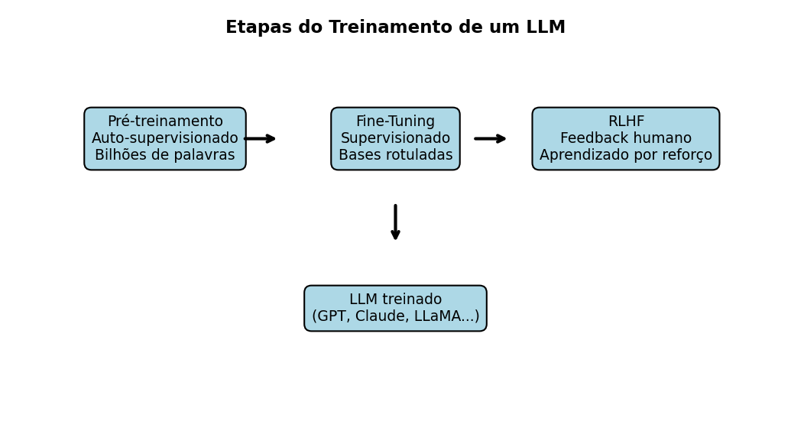

<!-- Breadcrumbs -->

· [← Série de LLMs 🤖](../index.qmd)

---

🎯 **Post Anterior:** 👉 [Atenção em Transformers: Q, K, V e Multi-Head Attention](atencao-transformers-qkv-mha.qmd)

---

## 🔷 Introdução

Os **Large Language Models (LLMs)** como GPT, Claude e LLaMA não “nascem prontos”.  
Eles passam por um processo de **treinamento em múltiplas etapas**, para aprender primeiro os padrões gerais da linguagem e depois serem ajustados para tarefas específicas.  

As três etapas principais são:  
1. **Pré-treinamento (auto-supervisionado)**  
2. **Fine-Tuning (ajuste supervisionado)**  
3. **RLHF (Reinforcement Learning with Human Feedback)**  

---

## 📖 1. Pré-treinamento auto-supervisionado

- É a **fase inicial e mais cara** do treinamento.  
- O modelo recebe enormes quantidades de texto (livros, artigos, sites).  
- A tarefa é simples: **prever a próxima palavra (token)** em uma sequência.  

Exemplo:  
Frase: “O céu está ___”.  
👉 O modelo aprende a prever “azul”.  

### Características:

- Não precisa de rótulos humanos → é **auto-supervisionado**.  
- Ensina o modelo a **estatística da linguagem** (gramática, estilo, vocabulário).  
- Gera o “cérebro básico” do LLM.  

::: {.callout-tip title="💡 Lembre-se"}
Pré-treinamento = **exposição massiva a textos**.  
O modelo aprende **como a língua funciona**, mas ainda **não sabe seguir instruções humanas**.
:::

## 🧩 Quiz — Pré-treinamento

:::::{.question}
**Q1.** O pré-treinamento de um LLM é chamado de **auto-supervisionado** porque:

::::{.choices}
:::{.choice}
Depende de milhões de rótulos feitos por humanos.
:::

:::{.choice .correct-choice}
A própria sequência de palavras fornece os rótulos (a próxima palavra).
:::

:::{.choice}
Usa apenas textos traduzidos automaticamente.
:::
::::
:::::

---

## 🛠️ 2. Fine-Tuning supervisionado

Depois do pré-treinamento, o modelo é **especializado** para tarefas específicas.  

- Usa bases menores, mas **rotuladas manualmente**.  
- Exemplo: pares de **pergunta → resposta**, diálogos ou resumos corretos.  
- Permite que o modelo aprenda a **seguir instruções**.  

👉 É nessa fase que o modelo aprende a se comportar como um **assistente útil**.  

::: {.callout-note title="📊 Diferença básica"}
- **Pré-treinamento**: aprende a linguagem em geral.  
- **Fine-tuning**: aprende **o que fazer** com a linguagem.
:::

## 🧩 Quiz — Fine-Tuning

:::::{.question}
**Q2.** No fine-tuning supervisionado, a base de dados é:

::::{.choices}
:::{.choice}
Gerada automaticamente pelo próprio modelo.
:::

:::{.choice .correct-choice}
Rotulada manualmente por humanos (pares de entrada → saída correta).
:::

:::{.choice}
Aleatória, sem necessidade de rótulos.
:::
::::
:::::

---

## 🎯 3. RLHF (Aprendizado por Reforço com Feedback Humano)

Mesmo com fine-tuning, os modelos ainda podem gerar respostas sem utilidade ou até perigosas.  
Para corrigir isso, entra o **RLHF (Reinforcement Learning with Human Feedback)**.

### Como funciona:
1. Humanos avaliam várias respostas do modelo.  
2. Essas avaliações geram um **ranking de preferências**.  
3. Um **modelo de recompensa** é treinado com esse ranking.  
4. O LLM principal é ajustado usando **algoritmos de aprendizado por reforço** (ex: PPO — *Proximal Policy Optimization*).  

👉 Resultado: o modelo aprende não só a responder, mas a responder **do jeito que preferimos**.  

::: {.callout-note title="🍽️ Analogia prática"}
Pense num **aprendiz de chef**:  

- Primeiro, ele aprende **todas as receitas possíveis** (pré-treinamento).  
- Depois, pratica apenas as **receitas do restaurante** (fine-tuning).  
- Por fim, os **clientes avaliam os pratos** e o chef ajusta até agradar mais gente (RLHF).  
:::
 

---

## 🖼️ Visualizando o Processo de Treinamento

{fig-align="center" width="95%"}

:::: {.callout-important collapse="true" title="Código em Python (clique para expandir) -- gera a imagem acima"}
```{python}
# Gera e salva "images/llm-training-stages.png"
from pathlib import Path
import matplotlib.pyplot as plt

out = Path("images"); out.mkdir(parents=True, exist_ok=True)
outfile = out / "llm-training-stages.png"

fig, ax = plt.subplots(figsize=(7, 4), dpi=150)

boxes = {
    "pretrain": {"text": "Pré-treinamento\nAuto-supervisionado\nBilhões de palavras", "xy": (0.2, 0.7)},
    "finetune": {"text": "Fine-Tuning\nSupervisionado\nBases rotuladas", "xy": (0.5, 0.7)},
    "rlhf": {"text": "RLHF\nFeedback humano\nAprendizado por reforço", "xy": (0.8, 0.7)},
    "final": {"text": "LLM treinado\n(GPT, Claude, LLaMA...)", "xy": (0.5, 0.3)}
}

# caixas
for box in boxes.values():
    ax.text(box["xy"][0], box["xy"][1], box["text"], fontsize=9,
            ha="center", va="center",
            bbox=dict(boxstyle="round,pad=0.5", facecolor="lightblue", edgecolor="black"))

# setas
ax.annotate("", xy=(0.35, 0.7), xytext=(0.3, 0.7), arrowprops=dict(arrowstyle="->", lw=2))
ax.annotate("", xy=(0.65, 0.7), xytext=(0.6, 0.7), arrowprops=dict(arrowstyle="->", lw=2))
ax.annotate("", xy=(0.5, 0.45), xytext=(0.5, 0.55), arrowprops=dict(arrowstyle="->", lw=2))

ax.text(0.5, 0.95, "Etapas do Treinamento de um LLM", ha="center", fontsize=11, weight="bold")

ax.axis("off")
plt.tight_layout()
plt.savefig(outfile, bbox_inches="tight")
plt.close()
print(f"Figura salva em: {outfile}")
```
:::

## 🧩 Quiz — RLHF

:::::{.question}
**Q3.** No RLHF, o papel do modelo de recompensa é:

::::{.choices}
:::{.choice}
Gerar automaticamente perguntas novas.
:::

:::{.choice .correct-choice}
Aprender, a partir de rankings humanos, quais respostas são preferidas.
:::

:::{.choice}
Corrigir erros gramaticais no texto.
:::
::::
:::::

---

## 📊 Resumo Comparativo

| Etapa | Dados usados | Tipo de aprendizado | Objetivo |
|-------|--------------|---------------------|----------|
| **Pré-treinamento** | Texto bruto (livros, sites, artigos) | Auto-supervisionado | Aprender a **linguagem geral** |
| **Fine-Tuning** | Conjuntos menores rotulados (perguntas/respostas, diálogos) | Supervisionado | Ensinar o modelo a **seguir instruções** |
| **RLHF** | Rankings de respostas preferidas por humanos | Reforço com feedback humano | Ajustar para **alinhamento e utilidade** |

👉 Essa progressão transforma um modelo “cru” em um **assistente conversacional confiável**.

## 🧩 Quiz — Etapas do treinamento

:::::{.question}
**Q4.** Qual sequência descreve melhor o treinamento típico de um LLM moderno?

::::{.choices}
:::{.choice}
RLHF → pré-treinamento → fine-tuning.
:::

:::{.choice .correct-choice}
Pré-treinamento → fine-tuning → RLHF.
:::

:::{.choice}
Fine-tuning → tokenização → remoção do modelo de recompensa.
:::
::::
:::::

---

## 👉 Em resumo

::: {.callout-tip title="🤖 Por que dizemos que um LLM não 'nasce pronto'?"}
Um **Large Language Model (LLM)** não surge já sabendo responder perguntas, traduzir textos ou escrever código.

Ele passa por um processo de treinamento em camadas:

1. **Pré-treinamento:**
   - lê grandes volumes de texto;
   - aprende padrões gerais da linguagem;
   - torna-se capaz de completar sequências de texto.

2. **Fine-tuning supervisionado:**
   - recebe exemplos mais específicos;
   - aprende a seguir instruções;
   - passa a responder de modo mais útil em tarefas práticas.

3. **RLHF:**
   - incorpora preferências humanas;
   - usa rankings de respostas;
   - ajusta o comportamento do modelo para respostas mais úteis, seguras e alinhadas.

Assim como uma pessoa passa por aprendizado básico, educação orientada e ajustes sociais, um LLM também precisa de etapas sucessivas para se tornar um assistente útil.
:::

## ✅ Conclusão

O treinamento de um LLM acontece em camadas:

1. **Pré-treinamento** → ensina padrões gerais da linguagem.
2. **Fine-tuning** → adapta o modelo para seguir instruções.
3. **RLHF** → refina o comportamento com preferências humanas.

Esse processo transforma um modelo estatístico de linguagem em um sistema mais útil para conversação, programação, resumo, tradução, explicação e várias outras tarefas.

No próximo post, vamos explorar os **desafios e limitações dos LLMs**: vieses, alucinações, custos computacionais e riscos de uso. ⚠

---

## 🔗 Navegação

🎯 **Post anterior:** 👉 [Atenção em Transformers: Q, K, V e Multi-Head Attention](atencao-transformers-qkv-mha.qmd)
🎯 **Próximo post:** 👉 [Desafios e Limitações dos LLMs](desafios-limitacoes.qmd)

---

<!-- Breadcrumbs -->

· [← Série de LLMs 🤖](../index.qmd) · 🔝 [Topo](#top)

---



:::{.callout-note}
*Criado por Blog do Marcellini com ❤ e código.*
:::

## 🔗 Links úteis

- [🧑‍🏫 Sobre o Blog](/posts/pessoal/sobre-o-blog.qmd)
- 💻 <a href="https://github.com/marcellini-celso/blog-marcellini-pt.git" target="_blank">GitHub do Projeto</a>
- 📬 [Contato por E-mail](mailto:prof.marcellini@gmail.com)
