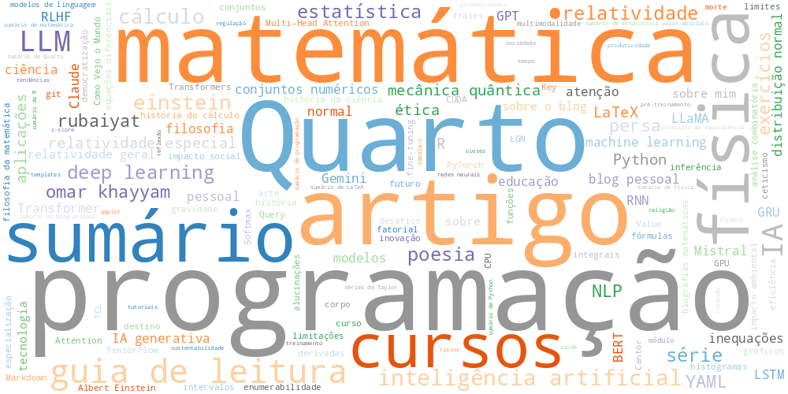

::: {.tag-nuvem}
{width=100%}
:::

## 📚 Todas as Tags

::: {.tag-grid}

<a href="/tags/programacao.html" class="tag-card">programação (18)</a>
<a href="/tags/quarto.html" class="tag-card">Quarto (14)</a>
<a href="/tags/matematica.html" class="tag-card">matemática (14)</a>
<a href="/tags/artigo.html" class="tag-card">artigo (13)</a>
<a href="/tags/sumario.html" class="tag-card">sumário (12)</a>
<a href="/tags/fisica.html" class="tag-card">física (11)</a>
<a href="/tags/cursos.html" class="tag-card">cursos (9)</a>
<a href="/tags/guia-de-leitura.html" class="tag-card">guia de leitura (9)</a>
<a href="/tags/ia.html" class="tag-card">IA (7)</a>
<a href="/tags/llm.html" class="tag-card">LLM (7)</a>
<a href="/tags/inteligencia-artificial.html" class="tag-card">inteligência artificial (7)</a>
<a href="/tags/calculo.html" class="tag-card">cálculo (6)</a>
<a href="/tags/einstein.html" class="tag-card">einstein (6)</a>
<a href="/tags/deep-learning.html" class="tag-card">deep learning (5)</a>
<a href="/tags/estatistica.html" class="tag-card">estatística (5)</a>
<a href="/tags/poesia.html" class="tag-card">poesia (5)</a>
<a href="/tags/relatividade.html" class="tag-card">relatividade (5)</a>
<a href="/tags/serie.html" class="tag-card">série (5)</a>
<a href="/tags/nlp.html" class="tag-card">NLP (4)</a>
<a href="/tags/yaml.html" class="tag-card">YAML (4)</a>
<a href="/tags/exercicios.html" class="tag-card">exercícios (4)</a>
<a href="/tags/omar-khayyam.html" class="tag-card">omar khayyam (4)</a>
<a href="/tags/persa.html" class="tag-card">persa (4)</a>
<a href="/tags/rubaiyat.html" class="tag-card">rubaiyat (4)</a>
<a href="/tags/latex.html" class="tag-card">LaTeX (3)</a>
<a href="/tags/python.html" class="tag-card">Python (3)</a>
<a href="/tags/r.html" class="tag-card">R (3)</a>
<a href="/tags/aplicacoes.html" class="tag-card">aplicações (3)</a>
<a href="/tags/mecanica-quantica.html" class="tag-card">mecânica quântica (3)</a>
<a href="/tags/relatividade-especial.html" class="tag-card">relatividade especial (3)</a>
<a href="/tags/etica.html" class="tag-card">ética (3)</a>
<a href="/tags/bert.html" class="tag-card">BERT (2)</a>
<a href="/tags/claude.html" class="tag-card">Claude (2)</a>
<a href="/tags/gpt.html" class="tag-card">GPT (2)</a>
<a href="/tags/gru.html" class="tag-card">GRU (2)</a>
<a href="/tags/gemini.html" class="tag-card">Gemini (2)</a>
<a href="/tags/ia-generativa.html" class="tag-card">IA generativa (2)</a>
<a href="/tags/llama.html" class="tag-card">LLaMA (2)</a>
<a href="/tags/lstm.html" class="tag-card">LSTM (2)</a>
<a href="/tags/mistral.html" class="tag-card">Mistral (2)</a>
<a href="/tags/rlhf.html" class="tag-card">RLHF (2)</a>
<a href="/tags/rnn.html" class="tag-card">RNN (2)</a>
<a href="/tags/transformer.html" class="tag-card">Transformer (2)</a>
<a href="/tags/atencao.html" class="tag-card">atenção (2)</a>
<a href="/tags/blog-pessoal.html" class="tag-card">blog pessoal (2)</a>
<a href="/tags/ciencia.html" class="tag-card">ciência (2)</a>
<a href="/tags/conjuntos-numericos.html" class="tag-card">conjuntos numéricos (2)</a>
<a href="/tags/distribuicao-normal.html" class="tag-card">distribuição normal (2)</a>
<a href="/tags/educacao.html" class="tag-card">educação (2)</a>
<a href="/tags/filosofia.html" class="tag-card">filosofia (2)</a>
<a href="/tags/inequacoes.html" class="tag-card">inequações (2)</a>
<a href="/tags/machine-learning.html" class="tag-card">machine learning (2)</a>
<a href="/tags/modelos.html" class="tag-card">modelos (2)</a>
<a href="/tags/normal.html" class="tag-card">normal (2)</a>
<a href="/tags/pessoal.html" class="tag-card">pessoal (2)</a>
<a href="/tags/relatividade-geral.html" class="tag-card">relatividade geral (2)</a>
<a href="/tags/sobre.html" class="tag-card">sobre (2)</a>
<a href="/tags/sobre-mim.html" class="tag-card">sobre mim (2)</a>
<a href="/tags/sobre-o-blog.html" class="tag-card">sobre o blog (2)</a>
<a href="/tags/tecnologia.html" class="tag-card">tecnologia (2)</a>
<a href="/tags/albert-einstein.html" class="tag-card">Albert Einstein (1)</a>
<a href="/tags/attention.html" class="tag-card">Attention (1)</a>
<a href="/tags/cpu.html" class="tag-card">CPU (1)</a>
<a href="/tags/cuda.html" class="tag-card">CUDA (1)</a>
<a href="/tags/cantor.html" class="tag-card">Cantor (1)</a>
<a href="/tags/como-vejo-o-mundo.html" class="tag-card">Como Vejo o Mundo (1)</a>
<a href="/tags/gpu.html" class="tag-card">GPU (1)</a>
<a href="/tags/key.html" class="tag-card">Key (1)</a>
<a href="/tags/lgn.html" class="tag-card">LGN (1)</a>
<a href="/tags/markdown.html" class="tag-card">Markdown (1)</a>
<a href="/tags/multi-head-attention.html" class="tag-card">Multi-Head Attention (1)</a>
<a href="/tags/pytorch.html" class="tag-card">PyTorch (1)</a>
<a href="/tags/query.html" class="tag-card">Query (1)</a>
<a href="/tags/softmax.html" class="tag-card">Softmax (1)</a>
<a href="/tags/tcl.html" class="tag-card">TCL (1)</a>
<a href="/tags/tensorflow.html" class="tag-card">TensorFlow (1)</a>
<a href="/tags/transformers.html" class="tag-card">Transformers (1)</a>
<a href="/tags/value.html" class="tag-card">Value (1)</a>
<a href="/tags/alucinacoes.html" class="tag-card">alucinações (1)</a>
<a href="/tags/analise-combinatoria.html" class="tag-card">análise combinatória (1)</a>
<a href="/tags/arte.html" class="tag-card">arte (1)</a>
<a href="/tags/biografias-matematicas.html" class="tag-card">biografias matemáticas (1)</a>
<a href="/tags/ceticismo.html" class="tag-card">ceticismo (1)</a>
<a href="/tags/conjuntos.html" class="tag-card">conjuntos (1)</a>
<a href="/tags/corpo.html" class="tag-card">corpo (1)</a>
<a href="/tags/curso.html" class="tag-card">curso (1)</a>
<a href="/tags/democratizacao.html" class="tag-card">democratização (1)</a>
<a href="/tags/derivadas.html" class="tag-card">derivadas (1)</a>
<a href="/tags/desafios.html" class="tag-card">desafios (1)</a>
<a href="/tags/destino.html" class="tag-card">destino (1)</a>
<a href="/tags/eficiencia.html" class="tag-card">eficiência (1)</a>
<a href="/tags/enumerabilidade.html" class="tag-card">enumerabilidade (1)</a>
<a href="/tags/equacoes-diferenciais.html" class="tag-card">equações diferenciais (1)</a>
<a href="/tags/especializacao.html" class="tag-card">especialização (1)</a>
<a href="/tags/fatorial.html" class="tag-card">fatorial (1)</a>
<a href="/tags/filosofia-da-matematica.html" class="tag-card">filosofia da matemática (1)</a>
<a href="/tags/fine-tuning.html" class="tag-card">fine-tuning (1)</a>
<a href="/tags/frases.html" class="tag-card">frases (1)</a>
<a href="/tags/funcoes.html" class="tag-card">funções (1)</a>
<a href="/tags/futuro.html" class="tag-card">futuro (1)</a>
<a href="/tags/formulas.html" class="tag-card">fórmulas (1)</a>
<a href="/tags/git.html" class="tag-card">git (1)</a>
<a href="/tags/gravidade.html" class="tag-card">gravidade (1)</a>
<a href="/tags/graficos.html" class="tag-card">gráficos (1)</a>
<a href="/tags/histogramas.html" class="tag-card">histogramas (1)</a>
<a href="/tags/historia.html" class="tag-card">história (1)</a>
<a href="/tags/historia-da-ciencia.html" class="tag-card">história da ciência (1)</a>
<a href="/tags/historia-do-calculo.html" class="tag-card">história do cálculo (1)</a>
<a href="/tags/impacto-ambiental.html" class="tag-card">impacto ambiental (1)</a>
<a href="/tags/impacto-social.html" class="tag-card">impacto social (1)</a>
<a href="/tags/inferencia.html" class="tag-card">inferência (1)</a>
<a href="/tags/inovacao.html" class="tag-card">inovação (1)</a>
<a href="/tags/integrais.html" class="tag-card">integrais (1)</a>
<a href="/tags/intervalos.html" class="tag-card">intervalos (1)</a>
<a href="/tags/limitacoes.html" class="tag-card">limitações (1)</a>
<a href="/tags/limites.html" class="tag-card">limites (1)</a>
<a href="/tags/modelos-de-linguagem.html" class="tag-card">modelos de linguagem (1)</a>
<a href="/tags/morte.html" class="tag-card">morte (1)</a>
<a href="/tags/multimodalidade.html" class="tag-card">multimodalidade (1)</a>
<a href="/tags/modulo.html" class="tag-card">módulo (1)</a>
<a href="/tags/principio-da-equivalencia.html" class="tag-card">princípio da equivalência (1)</a>
<a href="/tags/probabilidades.html" class="tag-card">probabilidades (1)</a>
<a href="/tags/produtividade.html" class="tag-card">produtividade (1)</a>
<a href="/tags/pre-treinamento.html" class="tag-card">pré-treinamento (1)</a>
<a href="/tags/qqplot.html" class="tag-card">qqplot (1)</a>
<a href="/tags/redes-neurais.html" class="tag-card">redes neurais (1)</a>
<a href="/tags/reflexao.html" class="tag-card">reflexão (1)</a>
<a href="/tags/regulacao.html" class="tag-card">regulação (1)</a>
<a href="/tags/religiao.html" class="tag-card">religião (1)</a>
<a href="/tags/riscos.html" class="tag-card">riscos (1)</a>
<a href="/tags/saude.html" class="tag-card">saúde (1)</a>
<a href="/tags/sociedade.html" class="tag-card">sociedade (1)</a>
<a href="/tags/sumario-de-latex.html" class="tag-card">sumário de LaTeX (1)</a>
<a href="/tags/sumario-de-python.html" class="tag-card">sumário de Python (1)</a>
<a href="/tags/sumario-de-quarto.html" class="tag-card">sumário de Quarto (1)</a>
<a href="/tags/sumario-de-r.html" class="tag-card">sumário de R (1)</a>
<a href="/tags/sumario-de-estatistica.html" class="tag-card">sumário de estatística (1)</a>
<a href="/tags/sumario-de-fisica.html" class="tag-card">sumário de física (1)</a>
<a href="/tags/sumario-de-matematica.html" class="tag-card">sumário de matemática (1)</a>
<a href="/tags/sumario-de-programacao.html" class="tag-card">sumário de programação (1)</a>
<a href="/tags/sumario-do-blog-pessoal.html" class="tag-card">sumário do blog pessoal (1)</a>
<a href="/tags/sustentabilidade.html" class="tag-card">sustentabilidade (1)</a>
<a href="/tags/series-de-taylor.html" class="tag-card">séries de Taylor (1)</a>
<a href="/tags/tabela-z.html" class="tag-card">tabela-z (1)</a>
<a href="/tags/templates.html" class="tag-card">templates (1)</a>
<a href="/tags/tempo.html" class="tag-card">tempo (1)</a>
<a href="/tags/tendencias.html" class="tag-card">tendências (1)</a>
<a href="/tags/traducao.html" class="tag-card">tradução (1)</a>
<a href="/tags/treinamento.html" class="tag-card">treinamento (1)</a>
<a href="/tags/tutoriais.html" class="tag-card">tutoriais (1)</a>
<a href="/tags/valor-absoluto.html" class="tag-card">valor absoluto (1)</a>
<a href="/tags/vieses.html" class="tag-card">vieses (1)</a>
<a href="/tags/z-score.html" class="tag-card">z-score (1)</a>
<a href="/tags/algebra.html" class="tag-card">álgebra (1)</a>
:::
